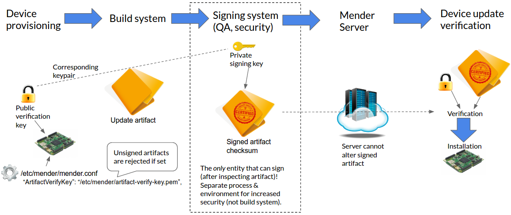

The goal for Mender is to provide a robust and secure software update process.
An important part of this is to give the Mender Client the ability to verify that the update comes from a trusted source. One way of achieving this is to sign the Artifact using a protected private key, which you store and use on a Signing system. The Mender Client can then verify it
using the corresponding public key. If the signature verification check passes, the client considers the update to come from a trusted source and continues. Otherwise the Mender Client refuses to proceed with the update and raises an error.

## Signature management flow

The following diagram shows the high level flow of creating and managing keys and Artifact signatures. These components are essential for the Artifact signing and verification process.



The process begins with provisioning a device with the public verification key, and configuring the Mender Client to use the key (with the `ArtifactVerifyKey` [configuration option](../../05.Client-configuration/05.Configuration-file/50.Configuration-options/docs.md#ArtifactVerifyKey)). After an Artifact is built, it is signed by the Signing system.

!!! Although it is convenient and possible to use the Build system as the Signing system, this lowers the security as unauthorized access to the private signing key is made easier for potential attackers (e.g. if the Build system is compromised). The best practice is to only sign Artifacts on an offline system, ideally as a manual operation after careful inspection of the Artifact.

After you have created and signed the Artifact you can make it available to the devices running the Mender Client by uploading it to the Mender Server.
During the update installation process, the Mender Client will verify the Artifact using the corresponding public key.
The Artifact will only be installed if the verification is successful.
If the `ArtifactVerifyKey` option is set and Artifacts are not signed or the verification fails, the Mender Client will abort the update process and report an error to the Mender Server.

! If the Mender Client is configured to enable signature verification (through the `ArtifactVerifyKey` option), it will reject any unsigned Artifacts. This is necessary because otherwise an attacker could simply inject unsigned Artifacts to bypass the signature verification.

## Supported signing algorithms

Mender supports the following signing algorithms:
* RSA with recommended key length of at least 3072 bits
* ECDSA with curve P-256

## Generating keys

In order to sign and later on verify the signature of the Mender Artifact we need to generate a private and public key pair.
Please follow the respective section below, depending on the signature algorithm you want to use.

After generating the keys you will have a file `private.key`, which you use only on the Signing system, as well as a
`public.key` which you [provision all the devices with](../../04.Artifacts/10.Yocto-project/03.Building-for-production/docs.md#artifact-signing-and-verification-keys).

!!! We refer to the file `public.key` as `artifact-verify-key.pem` on the devices to avoid ambiguity with other keys.

#### RSA

You can generate a private RSA key by executing the command below:

```bash
openssl genpkey -algorithm RSA -out private.key -pkeyopt rsa_keygen_bits:3072
openssl rsa -in private.key -out private.key
```

To extract a public key from the private key use following command:

```bash
openssl rsa -in private.key -out public.key -pubout
```

#### ECDSA256

In order to generate a public and private ECDSA key pair use the commands below:

```bash
openssl ecparam -genkey -name prime256v1 -out private-and-params.key
openssl ec -in private-and-params.key -out private.key
openssl ec -in private-and-params.key -pubout -out public.key
```

The resulting `private.key` and `public.key` files are the private and public keys, respectively.

## Signing

We use the `mender-artifact` tool to create a signed Artifact. Download the
prebuilt `mender-artifact` binary for your platform following the links in
[Downloads section](../../08.Downloads/docs.md#mender-artifact).

There are two ways to sign an Artifact: while creating it with the `write`
command or for existing artifacts using the `sign` command.
We add the `-k` parameter in both cases to specify the private key, which we will use for
creating the signature.

#### A raw root file system

<!--AUTOVERSION: "mender-%"/mender-->
```bash
mender-artifact write rootfs-image \
-t beaglebone \
-n mender-master \
-f core-image-base-beaglebone.ext4 \
-k private.key \
-o artifact-signed.mender
```

! Make sure the Artifact name specified by the `-n` parameter in the above command matches the value specified when your file system image was created.

#### An existing Mender Artifact

```bash
mender-artifact sign artifact.mender -k private.key -o artifact-signed.mender
```

The latter is typically the command that the Signing system uses to create a
signed Artifact from an unsigned one originating from the build system. Additionally, if you modify an Artifact using the `mender-artifact modify` command or any other method, the signature will need to be regenerated..

## Verifying the signature

After you create a signed Artifact, you can verify the signature with `mender-artifact` as well, using the
`-k` option, but this time with the location of the *public verification key*.

```bash
mender-artifact validate artifact-signed.mender -k public.key
```

## Enable Mender Client signature verification

To make it easier to provision your devices with the public verification key and corresponding Mender Client configuration,
Mender has integration with the Yocto Project. Please refer to the documentation for [Artifact signing and verification keys](../../04.Artifacts/10.Yocto-project/03.Building-for-production/docs.md#artifact-signing-and-verification-keys) to see how to include them.
