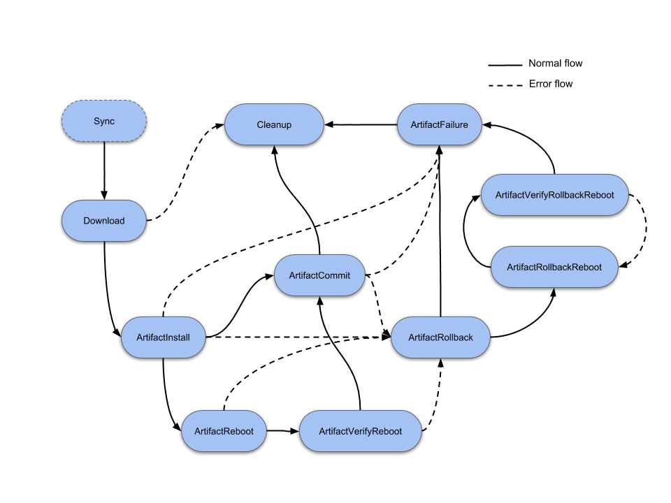
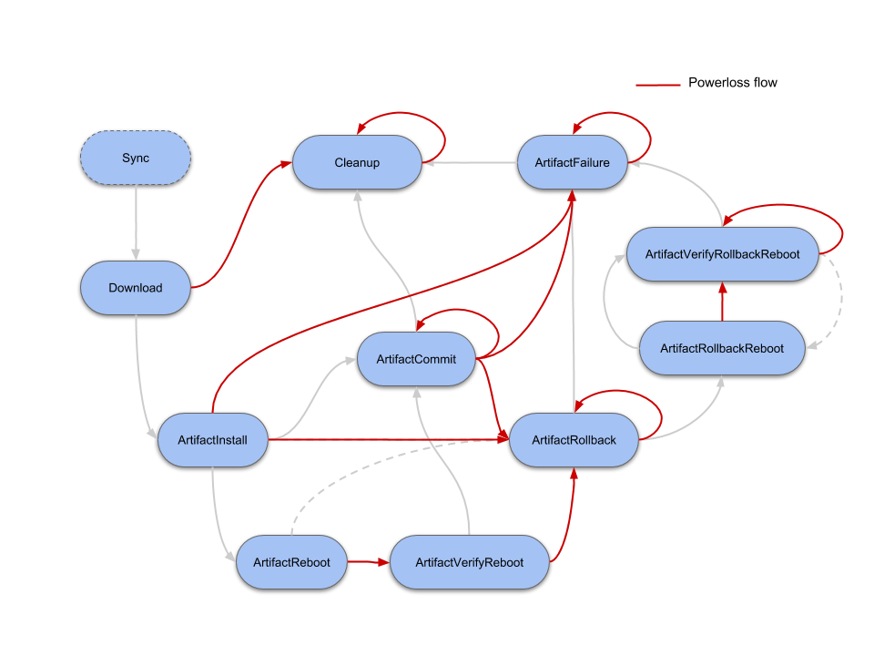

## Introduction

Historically, the first update mechanism in Mender was [dual rootfs updates](../../02.Overview/01.Introduction/docs.md#robust-operating-system-updates).
There is an alternative called _Update Modules_ which allow for different types of updates, including updates at the application level. This provides an opportunity to change the software on your devices in the active root filesystem.

An _Update Module_ is an extension to the Mender client for supporting a new type of software update, such as a package manager, container, bootloader or even updates of nearby microcontrollers. You can tailor an Update Module to a specific device or environment (e.g. update a proprietary bootloader), or be more general-purpose (e.g. install a set of `.deb` packages.).

You can find general-purpose Update Modules and documentation, including support for file-based, package based and container-based updates together with community-supported Update Modules at [Mender Hub](https://hub.mender.io/c/update-modules/13?target=_blank).

This document introduces how Update Modules work, so you can develop your own Update Modules that meet your specific needs.

An Update Module implements one or more of the actions that the Mender client carries out when installing an Artifact payload. The *core* action that all Update Modules must implement is the ArtifactInstall action, where the actual installation of an Artifact payload takes place. However, there are other actions that you may use depending on the desired functionality and use case for an Update Module, such as Rollback.

### Update Module basics

Technically speaking, an Update Module is an executable that follows a number of rules.

#### Executable

The entry point for an Update Module is an executable that is located under `/usr/share/mender/modules/v3` as of API v3. Most Update Modules use a shell script as their main executable and call subscripts as needed, but this is not a mandatory structure. As long as the file is executable on the target system, it can be implemented in any interpreted (bash, python, ...) or compiled (C++, Rust, ...) language.
 
#### Update Module API

The executable will be called with defined arguments, is expected to print certain strings to `stdout` (`stderr` can be used for logging) and return a defined value upon invocation. This is called the `Update Module API`. It follows the general concept that the call will always have two parameters: *Action* and *path*.

1.  Action. This string is either the current state of the update process or an information request.
<!--AUTOVERSION: "mendersoftware/mender/blob/%/Documentation"/ignore-->
- The most relevant state is `ArtifactInstall`, which is the main installation step. Any actions that modify state of the installed software should be taken here. This could be either installing new files from the received artifact, or activating the payload received during the [download state](https://github.com/mendersoftware/mender/blob/master/Documentation/update-modules-v3-file-api.md#download-state). An exit value of 0 indicates success, any other value an error and will trigger the rollback procedure where applicable.
- A typical information request action is `NeedsArtifactReboot`. By querying this, the Mender Client can decide if it needs to initiate a full device reboot after update installation. This is an example where printing a string as response is required: `No` indicates that the Update Module does not require a reboot, `Automatic` requests a reboot following the standard strategy.

2. path to artifact context. This defines where the [File API](#file-api) is exposed.

<!--AUTOVERSION: "mendersoftware/mender/blob/%/Documentation"/ignore-->
For more detailed information on all actions and their respective semantics, please see the documentation in the [source code repository](https://github.com/mendersoftware/mender/blob/master/Documentation/update-modules-v3-file-api.md#states-and-execution-flow).

#### File API

<!--AUTOVERSION: "mendersoftware/mender/blob/%/Documentation"/ignore-->
The File API exposes the artifact context to the Update module. This is done through a directory tree that contains the various header parts, as well as the actual payload. The files contained in the Mender Artifact are located in the `files` directory and can be directly accessed. For more details on the File API, please see the documentation in the [source code repository](https://github.com/mendersoftware/mender/blob/master/Documentation/update-modules-v3-file-api.md#file-api).

<!--AUTOVERSION: "mendersoftware/mender/blob/%/Documentation"/ignore-->
During the `Download` state, the files are not yet available yet, but provided as streams for direct processing. They are exposed as documented in the [source code repository](https://github.com/mendersoftware/mender/blob/master/Documentation/update-modules-v3-file-api.md#streams-tree).

### The state machine workflow

Update Modules follow the same execution flow as [state scripts](../../06.Artifact-creation/04.State-scripts/docs.md). For the development of Update Modules it is important to have a basic understanding of it.

<!-- Source is at: https://docs.google.com/drawings/d/1IbqjK5R87KuIDKX11MQB4UlvaapbCK9lC-HLbQjDvIQ/edit -->


The most relevant states for developing an Update Module are:

* `ArtifactInstall`: you should use it to install the update into its final destination.
* `ArtifactCommit`: you should use it to make the update permanent, in cases where the roll back is still possible.
* `ArtifactRollback`: you should use it to roll back to the previously known good state, normally by restoring some kind of backup.

Every state is optional for an Update Module to implement, however in practice all Update Modules will implement the `ArtifactInstall` state.

The following states can be implemented for more advanced use cases:

* `ArtifactReboot` and `ArtifactVerifyReboot` states relate to the reboot procedure and verification for a given Artifact installation, if needed. The Update Module can implement them, for instance, for a peripheral update, where you need to perform some special action before the reboot takes place.
* `ArtifactRollbackReboot` and `ArtifactRollbackVerifyReboot`: you need to use those when the Update Module requires a system reboot after a successful roll back in order to restore the previous software version.

Please refer to [further reading](#further-reading) for more details.

## Prerequisites

### The Mender Server

The best and recommended way of running Mender is the [managed mode](../../02.Overview/01.Introduction/docs.md#client-modes-of-operation) with [hosted Mender](https://hosted.mender.io?target=_blank). You can also try the [on-premise demo server](../../07.Server-installation/02.Evaluation-with-docker-compose/docs.md) for quick testing.

!!! Hosted Mender is available in multiple [regions](/11.General/00.Hosted-Mender-regions/docs.md) to connect to. Make sure you select your desired one before proceeding.

### A Device with a Mender client

You will need a device with a Mender client installed. For development purposes you also need shell access to the device (e.g. via [SSH](../../01.Get-started/01.Preparation/01.Prepare-a-Raspberry-Pi-device/docs.md#step-2-ssh-into-the-raspberry-pi)).

To install the Mender client on your device, follow the instructions in the [Installing](../../03.Client-installation/02.Install-with-Debian-package/docs.md) documentation.

### Workstation with mender-artifact

We will use the `mender-artifact` tool to create the payloads required for Update Modules to work.

First you need to download a prebuilt `mender-artifact` binary for your platform following the links in [Downloads section](../../10.Downloads/docs.md#mender-artifact).

## Basic example: File copy Update Module

In this first basic example we will create an Update Module that copies files into `/var/www` directory on the device.

### Create the Update Module script

In the device terminal, go to `/usr/share/mender/modules/v3`:

```bash
cd /usr/share/mender/modules/v3
```

Next, create a script named `web-file` with the following command:


```bash
cat << "EOF" > web-file
#!/bin/bash

set -e

STATE="$1"
FILES="$2"

case "$STATE" in
    ArtifactInstall)
        cp "$FILES"/files/* /var/www
        ;;
esac
exit 0
EOF
```

Then add execute permission to the script:

```bash
chmod +x web-file
```

Finally, create the directory for the update files to be installed in:
```bash
mkdir -p /var/www
```

Your Mender client is now able to handle Artifacts of type `web-file` (see below for the exact relation between the name of the Update Module and the type of the Artifact).

### Create an Artifact with a payload for the new Update Module

On your workstation, go to the directory where you have downloaded (or built) `mender-artifact` previously.

First, simply create a file you want to install to the www directory:

```bash
echo 'Installed by Mender!' > hello-world
```

Set your device type:

```bash
DEVICE_TYPE="raspberrypi4"
```

!!! Adjust the command above to match your device type.

Then create a new Mender Artifact with the `hello-world` file as the only payload, for your new `web-file` Update Module:

```bash
./mender-artifact write module-image \
    -t $DEVICE_TYPE \
    -o web-file-1.mender \
    -T web-file \
    -n web-file-1.0 \
    -f hello-world
```

The command line options are detailed below:
* `-t` - The compatible device type of this Mender Artifact.
* `-o` - The path where to place the output Mender Artifact. This should always have a .mender suffix.
* `-T` - The payload type. It should be the same as the Update Module name and corresponds to the filename of the script which is present inside the `/usr/share/mender/modules/v3` directory.
* `-n` - The name of the Mender Artifact.
* `-f` - The path to the file(s) to send to the device(s) in the update.

For more details, see `mender-artifact write module-image --help`

### Upload and deploy your Artifact

Go to the Artifacts tab in the Mender Server UI and upload your newly generated Mender Artifact. Now go to Deployments and deploy the Artifact to All devices. It should finish within a minute or so.

### Upload and deploy your Artifact in Standalone Mode

Copy your newly generated Mender Artifact to the target device, e.g.: using scp:


```bash
scp web-file-1.mender <username>@<deviceip>:/tmp
```

Then install the Mender Artifact on the target device:

```bash
mender-update install /tmp/web-file-1.mender
```

<!--AUTOVERSION: "Before `mender-update` %"/ignore "mender-client below version %"/ignore-->
!!! Note: Before `mender-update` 4.0.0 was released, the `install` command was built into the `mender` binary. If you are using mender-client below version 4.0.0, use `mender-update` instead of `mender` in the snippet above.

### Verify the deployment on the device

Once the deployment finished, you should find the payload you created and your `web-file` Update Module installed:

```bash
cat /var/www/hello-world
```
It should say `Installed by Mender!`.

### Multiple files

The `mender-artifact` tool allows you to supply multiple files using the `-f` flags. This means we can create an Artifact with more than one file like this:

```bash
./mender-artifact write module-image \
    -t $DEVICE_TYPE \
    -o web-file-1.mender \
    -T web-file \
    -n web-file-1.1 \
    -f my-file-1 \
    -f my-file-2 \
    -f my-file-3
```

The command line options are detailed below:
* `-t` - The compatible device type of this Mender Artifact.
* `-o` - The path where to place the output Mender Artifact. This should always have a .mender suffix.
* `-T` - The payload type. It should be the same as the Update Module name and corresponds to the filename of the script which is present inside the `/usr/share/mender/modules/v3` directory.
* `-n` - The name of the Mender Artifact.
* `-f` - The path to the file(s) to send to the device(s) in the update.

Deploying such an Artifact will result in the three new files installed on the target.

## Advanced example: Update Module with Rollback

In this section we are going to be using a more advanced Update Module which supports Rollback in a rare case when something during the installation does not go as expected.

For an Update Module to support Rollback, you have to make two additions in the implementation:
* Return "Yes" on `SupportsRollback` action call
* Implement a mechanism that will save a "known good state" before the installation in `ArtifactInstall`, and restore that state in `ArtifactRollback`.

See below the command to create the updated version of our `web-file` Update Module:

! The updated version of the Update Module will remove all files in `/var/www`. It is meant to showcase the usage of the feature but can be unsafe in real environments.

```bash
cat << "EOF" > web-file
#!/bin/bash

set -e

STATE="$1"
FILES="$2"

prev_files_tar="$FILES"/tmp/prev_files.tar

case "$STATE" in
    SupportsRollback)
        echo "Yes"
        ;;

    ArtifactInstall)
        (cd /var/www && find . -maxdepth 1 -type f -exec tar -rf $prev_files_tar {} \;)
        find /var/www -maxdepth 1 -type f | xargs rm
        expected_md5sums=$(md5sum "$FILES"/files/* | sort | cut -d' ' -f1)
        cp "$FILES"/files/* /var/www
        actual_md5sums=$(find /var/www -maxdepth 1 -type f | xargs md5sum | sort | cut -d' ' -f1)
        [[ "$actual_md5sums" == "$expected_md5sums" ]] || exit 1
        ;;

    ArtifactRollback)
        [[ -f $prev_files_tar ]] || exit 1
        find /var/www -maxdepth 1 -type f | xargs rm
        tar -xf $prev_files_tar -C /var/www
        ;;
esac
exit 0
EOF
```

This new version of the `web-file` Update Module implements a simple mechanism to restore the previous state (i.e. files in `/var/www` before the update). It saves a tarball with all current files in `/var/www` (only the single files, not directories) before removing them and copying the new set of files coming from the archive. After copying the files, it will check that the md5sum of all copied files is the same as the files contained in the incoming Artifact. If they differ, the script will exit with error code `1` for this `ArtifactInstall` phase. Finally, the Mender client will interpret this error code as a failure, check if our Update Module supports rollback, and then again call the module with `ArtifactRollback` option, where the module will restore the old files.

!!! You can experiment with the rollback mechanism by forcing the update to fail. For example, creating a directory under `/var/www` with the same name as one of the files contained in the incoming Artifact will trigger an error in the `cp` command. Once this happens, the Update Module should restore the previous files.

## Power loss

In general, if a device loses power during an update, Mender will transition into an error state, such as ArtifactRollback or ArtifactFailure. If the client is already in an error state, that state will typically be repeated until the update is installed without interruption. However, the exact state execution flow depends on whether the Update Module supports rollback and whether it reboots. See the diagram below for all the possible execution flows during a power loss:

<!-- Source is at: https://docs.google.com/drawings/d/19Oy6lLi_H2oLZtnyH1S9vfroTbHmeGmtzUAPKw8Xh7s/edit -->


Because of the possible re-execution described above, you should develop Update Modules to be idempotent. This means that re-running the module with the same state several times, even partially, should have the same effect as running it once, as long as the last execution is a complete one.

## Further reading

<!--AUTOVERSION: "blob/%/Documentation"/mender -->
* [Update Modules v3 protocol](https://github.com/mendersoftware/mender/blob/4.0.4/Documentation/update-modules-v3-file-api.md?target=_blank)
