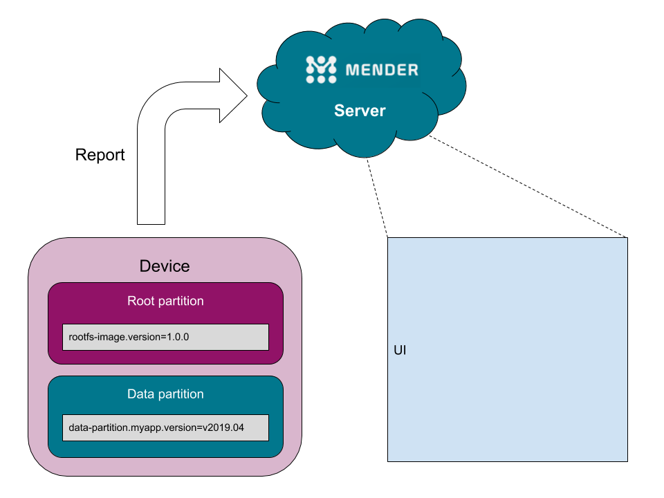
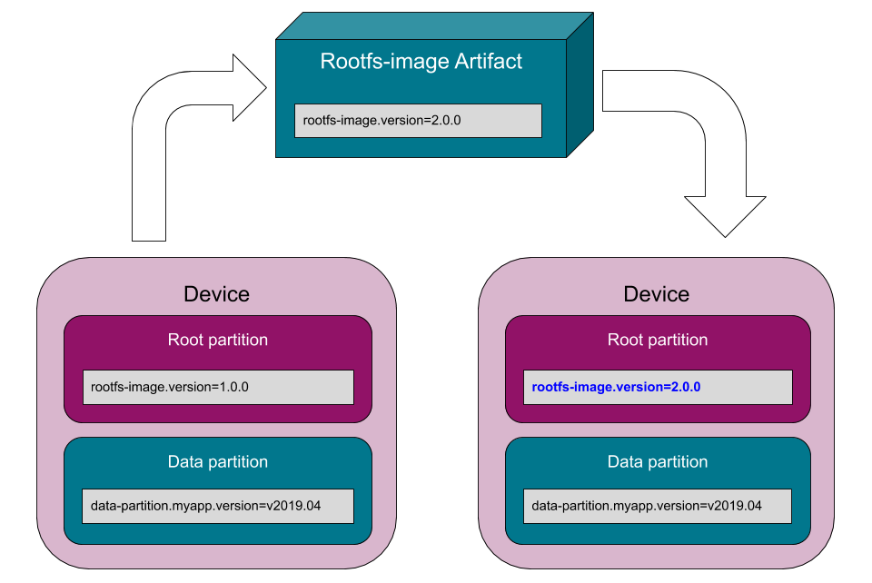
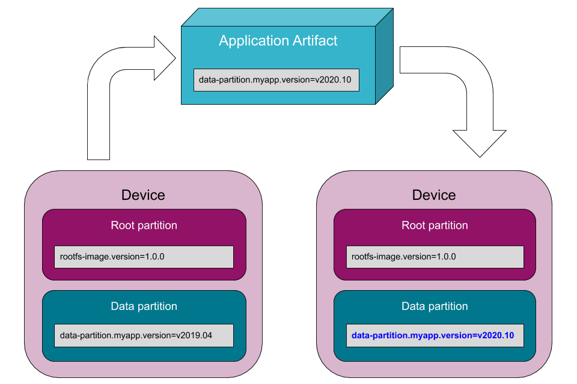

## Introduction

Reporting the current software version running on a device can be challenging when mixing full system updates and application updates. On top of this, installing software on different partitions than the root filesystem requires additional flexibility in storing and reporting the current version of software installed into the device.

For these reasons, the Mender Artifact utility supports several options to customize the current software version's reporting, both for full system updates and application updates via Update Modules.

The software versioning information is stored in the Mender Artifacts as [*Provides* fields](../../02.Overview/02.Artifact/docs.md#provides-and-depends), and is automatically reported by the Mender Client as inventory data. See below for further details on how to override the default software versioning keys when generating the Artifacts.



## Full system updates

When creating a full system update, the Mender Artifact utility automatically generates a *Provides* entry using the key `rootfs-image.version` and the Artifact name as the value. By default, the Mender Client will automatically report such a key/value pair as inventory data.

To override the value of the versioning key, which defaults to the Artifact's name, you can use the `--software-version` flag.

<!--AUTOVERSION: "value \"%\""/ignore-->
For example, to explicitly set the software version for a full system update to the value "1.0.0", you can use the following Mender Artifact command line:

<!--AUTOVERSION: "software-version %"/ignore-->
```bash
mender-artifact write rootfs-image \
    --software-version 1.0.0 \
   ...
```
The command above will generate the following versioning key/value pair:

<!--AUTOVERSION: "rootfs-image.version=%"/ignore-->
```console
rootfs-image.version=1.0.0
```

When installing the Artifact, the value above represents a stable version identifier for the "rootfs-image" which is installed on the device, and will only change if a new "rootfs-image" Artifact is installed. Installing other types of Artifacts, such as application updates, will not change it. The Artifact name however, will change every time a new Artifact is installed, and therefore represents the *last installed Artifact*.


*Effect on versions when installing a rootfs-image Artifact.*

### Inspect the version

To see the version information after the Artifact is deployed, try to expand a device in the Device list of the Mender UI. Alternatively, run this command on the device to display it from the command line (this may also display some unrelated fields):

```bash
mender show-provides
```

Example output:

<!--AUTOVERSION: "rootfs-image.version=%"/ignore-->
```console
rootfs-image.checksum=539fb70abbe1c680816c846219cef7cd409c96f130f652734e4bcfa5dd825dd3
rootfs-image.version=1.0.0
```

<!--AUTOVERSION: "field has been updated to `%`"/ignore-->
We can see that the `rootfs-image.version` field has been updated to `1.0.0`.

TODO Screenshots

## Application updates (Update modules)

When creating Application updates using the Update modules, the Mender Artifact utility automatically generates a *Provides* entry using the key `rootfs-image.MODULE.version`, where the name of the Update modules replaces `MODULE`, and the Artifact name as value. By default, the Mender Client will automatically report such a key/value pair as inventory data.

It is possible to customize this behaviour overriding the base key (`rootfs-image`) with a custom one using the `--software-filesystem` flag of `mender-artifact`. It is also possible to override the software name, which defaults to the name of the Update module, using the `--software-name` flag. If provided, the generated software version key will be `rootfs-image.NAME.version`. Additionally, to override the value of the versioning key, which defaults to the Artifact's name, you can use the `--software-version` flag.

<!--AUTOVERSION: "value \"%\""/ignore-->
For example, to explicitly set the software version for an application update to the value "v2020.10", you can use the following Mender Artifact command line:

<!--AUTOVERSION: "software-version %"/ignore-->
```bash
mender-artifact write module-image \
    -T script \
    --software-version v2020.10 \
   ...
```
The command above will generate the following versioning key/value pair:

<!--AUTOVERSION: "rootfs-image.script.version=%"/ignore-->
```console
rootfs-image.script.version=v2020.10
```

To have the Mender Client report a custom name for the software you are installing, you can override the software name in the versioning key using the `--software-name" flag as follows:

<!--AUTOVERSION: "software-version %"/ignore-->
```bash
mender-artifact write module-image \
    -T script \
    --software-name myapp \
    --software-version v2020.10 \
   ...
```
The command above will generate the following versioning key/value pair:

<!--AUTOVERSION: "rootfs-image.myapp.version=%"/ignore-->
```console
rootfs-image.myapp.version=v2020.10
```

Additionally, to track applications installed on other partitions than the rootfs, you can customize the name of the filesystem using the `--software-filesystem` flag, as follows:

<!--AUTOVERSION: "software-version %"/ignore-->
```bash
mender-artifact write rootfs-image \
    -T script \
    --software-filesystem data-partition \
    --software-name myapp \
    --software-version v2020.10 \
   ...
```
The command above will generate the following versioning key/value pair:

<!--AUTOVERSION: "data-partition.myapp.version=%"/ignore-->
```console
data-partition.myapp.version=v2020.10
```

Since we have selected `data-partition` as the filesystem which hosts the software, installing this Artifact will have no effect on the `rootfs-image.version`.


*Effect on versions when installing an application Artifact.*

### Inspect the versions

If we now inspect the versions installed like [described above](#inspect-the-version) we find that the `data-partition.myapp.version` field has changed.

<!--AUTOVERSION: "rootfs-image.version=%"/ignore-->
```console
data-partition.myapp.version=v2020.10
rootfs-image.checksum=539fb70abbe1c680816c846219cef7cd409c96f130f652734e4bcfa5dd825dd3
rootfs-image.version=1.0.0
```

In this example, we used the last of the Artifacts produced above, and we can see that `data-partition.myapp.version` has been updated to `v2020.10`.

!!! Notice that `rootfs-image.version` is still the value of the original "rootfs-image" Artifact. This is the key feature of software naming: A device can host versions of multiple different components at the same time.

TODO Screenshots

### Application updates on the root filesystem

The example in the previous section differs from what would happen if we installed the "myapp" application on the root filesystem instead. Since a rootfs-image update overwrites the entire filesystem, any extra applications that have been installed on the filesystem will be erased. See this example:


*Effect on versions when installing a rootfs-image Artifact on the same filesystem as an application.*

As you can see, Mender has erased the version information for "myapp", since it was on the old root filesystem, which has now been overwritten.

If the "myapp" application comes with the rootfs-image Artifact, and you want to reflect that in the version information, you can manually add this information by passing the `--provides rootfs-image.myapp.version:VERSION` flag to the mender-artifact utility when creating the Artifact. In this case the Artifact will provide two versions, one for "rootfs-image", and one for "myapp".


## Advanced usage

To support advanced software reporting needs, the Mender Artifact utility also supports the *Clear Provides* payload field, which contains a list of patterns to be removed from the *Provides* entries on the device.

Each pattern can contain multiple placeholders, each of them expressed using asterisks (`*`), which match a sequence of zero or more characters. For example, the pattern `rootfs-image.*` matches `rootfs-image.version` and `rootfs-image.checksum` but not `data-partition.checksum` nor `rootfs-image`.

Mender Artifacts supports the following options:

* `--clears-provides`: adds the specified pattern to the *Clear Provides*

* `--no-default-clears-provides`: disables the automatic generation of *Clear Provides* to gain full control on the patterns.

For example, to provide an alternative rootfs-image update method based on an Update Module, you would need an Artifact that clears the `rootfs-image.version` and `rootfs-image.checksum` *Provides* keys.
To achieve this goal, you could use the following command:

```bash
mender-artifact write module-image \
    -T custom-root-image \
    --software-filesystem rootfs-image \
    --no-default-clears-provides \
    --clears-provides 'rootfs-image.*' ...
```

In another context, you could need to update other partitions than the rootfs, still taking advantage of the software versioning but using a different key.
Given the `part2-image` versioning key, you could use the following command:

```bash
mender-artifact write module-image \
    -T part2-image \
    --software-filesystem part2-image \
    --no-default-clears-provides \
    --clears-provides 'part2-image.*' ...
```

Finally, you may want to support proxy updates, where multiple connected devices can update either fully or partially.
In this scenario, for the full updates to report correctly, you need to create them specifying a custom software versioning key, as follows:

```bash
mender-artifact write module-image \
    -T full-proxy-update \
    --software-filesystem device1-fs \
    --no-default-clears-provides \
    --clears-provides 'device1-fs.*' ...
```
