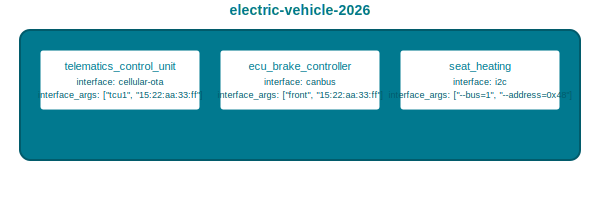

!! This section is a preview of Mender's support for Orchestrated updates using mender-orchestrator. It is not yet recommended for production use. Also, expect the APIs and configurations to evolve as the implementation matures.

!!! Devices running Mender Orchestrator must use the **system** [device tier](../../02.Overview/17.Device-tiers/docs.md). The system tier is specifically designed for devices that coordinate updates across multiple components.

Mender Orchestrator is the software responsible for updating the Components in a System.
It is responsible for inspecting the System's current state, such as the software versions running on the Components. The System's architecture is defined by the [Topology](../03.Topology/docs.md),
which specifies what Components are present and how they can be updated. Mender Orchestrator reads the System's desired state from a [Manifest](../02.Manifest/docs.md), which defines the exact combination
of Artifacts that should be deployed to each Component type and controls the update strategy. Mender Orchestrator then applies the changes to the different Components to reach the state described in the Manifest.
If this is not possible, Mender Orchestrator may roll back to the previously known working state, in other words, the previous version of the Manifest.

Mender Orchestrator uses a manifest-based deployment strategy where you define the desired end state in two YAML files:
- [Topology](../03.Topology/docs.md): Defines the System Components and their update capabilities
- [Manifest](../02.Manifest/docs.md): Defines the update for the System with specific Artifacts and ordering

Mender Orchestrator supports both full System updates and partial updates with granular component-level control. It downloads required Artifacts and coordinates the update process across all Components. If any Component fails, it rolls back the entire System to maintain a healthy end state.

## Concepts

### System

A System is a collection of interdependent Components that work together. Components can run on the same hardware device or across multiple devices that need to maintain version compatibility.

Examples of a System:
- a car consisting of multiple interconnected ECUs for infotainment, motor control, charging
- a drone with onboard sensors, GPS, a flight control computer, and communication modules
- an edge device with different software components versioned independently

For the purpose of introducing the Orchestrator, the example System will consist of the following Components:

**Telematic Control Unit**:
* Has internet access and can communicate with Mender Server
* Can deliver updates to all other Components

**ECU brake controller**:
* No direct internet access
* Updated over canbus

**Seat heating**:
* No direct internet access
* Updated over I2C

### Components

A Component is a logical unit that can be updated independently. Components are categorized by Component type and updated through Interfaces.
Each Component is defined in the [Topology](../03.Topology/docs.md).

We also define a `System device` as the Component that runs Mender Orchestrator and communicates with the Mender Server.
A System can only ever have exactly one Device in this taxonomy. In the context of this introduction, the Telematic Control
Unit functions as the System device.

### Update process

Components are updated sequentially by order value, ascending, as defined in the [Manifest](../02.Manifest/docs.md#update-strategy). Components with the same
order are updated in parallel (see [ordering](../04.Interface-protocol/docs.md#ordering)). It is up to a Component Type's Interface to implement rollback.
If an update to any Component fails, Mender Orchestrator will query the Interface with `SupportsRollback` and handle the rollback accordingly.
See the [ArtifactRollback state](../04.Interface-protocol/docs.md#artifactrollback-state) for more details.

Mender Orchestrator obtains Artifacts as specified in the Manifest, either from a local path or by downloading the Artifact from
the Mender Server when updating a Component. See the documentation on [Manifests](../02.Manifest/docs.md) for more details.

### Interface

An Interface is a command line application that serves as a translator between the updatable Component and Mender Orchestrator.
This decoupled design allows Mender Orchestrator to work with any custom set of steps or local network protocols a Component needs to be updated.

See the [Interface protocol documentation](../04.Interface-protocol/docs.md) for more information.

## Managed updates by leveraging Mender Client

### Update Module

In most cases we want to manage a fleet of Mender Orchestrator instances with the Mender Server.
To do this, we use the Mender Client to deploy an Artifact with the `mender-orchestrator-manifest` Update Module.
The Update Module can be found in [mender-orchestrator-support](https://github.com/mendersoftware/mender-orchestrator-support?target=_blank), and is provided by
the mender-orchestrator-support Yocto recipe and the mender-orchestrator-support Debian package, see the [installation section](../05.Installation) for more information.

`mender-orchestrator-manifest` is a regular Update Module that invokes Mender Orchestrator.
The Update Module enables the following update flow:
1. Mender Client receives an Artifact of payload type `mender-orchestrator-manifest`
2. The Update Module extracts the Manifest and calls Mender Orchestrator
3. Mender Orchestrator performs coordinated updates according to the Manifest
4. The Update Module handles System reboots and state transitions

### System type vs Device type

In order to run Mender Orchestrator with the Mender Client, you must configure the Device with the `system` tier (see [the Installation section](../05.Installation/)).
Once that is set, Mender Client will read the System type set in Mender Orchestrator's Topology.
The Mender Client will use the System type as its Type in two specific cases:

1. when polling for deployments
2. when installing Manifest Aritfacts, i.e. Artifacts with the payload type set to `mender-orchestrator-manifest`

The regular Device type will be used in all other cases. This allows a System device to receive and install Manifests
by checking the System type compatibility when needed. It also allows a System device to receive regular rootfs Updates.
