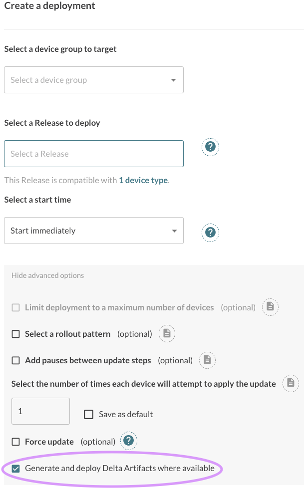
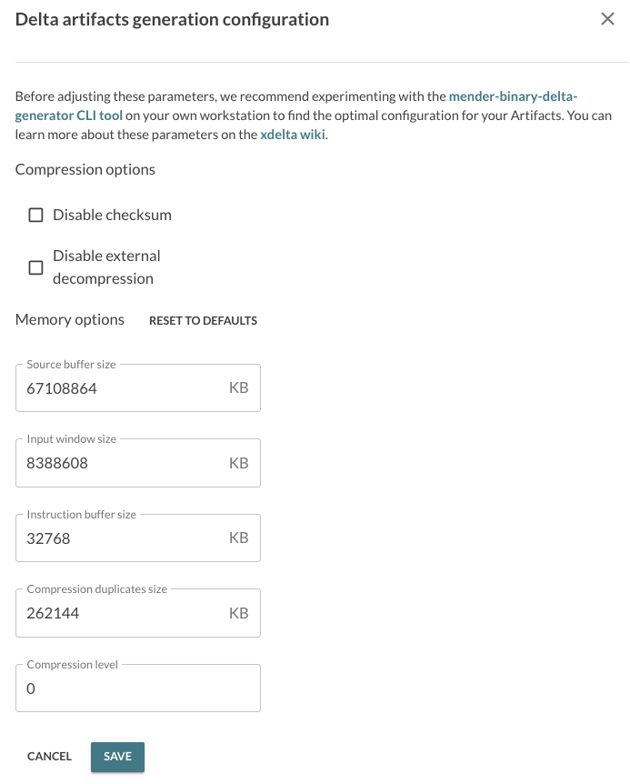

!!! The server-side delta feature is available only for the Enterprise plan, and we enable it by default for all the Enterprise tenants.

Mender Enterprise supports the server-side generation of Delta Artifacts.
This document explains the prerequisites to enable this feature and how it works.

## Prerequisites

### Hosted Mender

The Enterprise plan is required in order to use this feature. All the tenants with the Enterprise plan have access
to the server-side delta feature by default.

### On-premise installations

!!! This feature is available starting from the Mender Server version 3.6.

For on-premise installations between from Mender Server Enterprise 3.6 to 4.0, you need to enable
server-side delta generation for each tenant explicitly. Make sure to run this in an internal
network that has access to the Mender Server services, change your_tenant_id to the actual tenant ID to enable it for,
then run the following command:

```bash
TENANT_ID=your_tenant_id
curl -v -H "Content-Type: application/json;" -XPUT -d '{ "delta": { "enabled": true, "binary_delta_limits": { "jobs_in_parallel": { "max": 2 }, "queue_length": { "max": 4 } }, "binary_delta": { "timeout": 3600 } } }' http://mender-deployments:8080/api/internal/v1/deployments/tenants/${TENANT_ID}/config
```

### Requirements on a device

!!! This feature is available starting from the Mender Client version 3.5 and the Mender Server version 3.6.

!! Delta updates aren't supported with devices running UBIFS. If this is your use case please contact us at support@mender.io


To support the server-side generation of Delta Artifacts, your device must report the availability of the `mender-binary-delta` Update Module to the server.
This will happen automatically if you are building your firmware using Yocto and the `meta-mender` layer.
Otherwise, create and install your own bootstrap Artifact to provide these keys:

```bash
mender-artifact write bootstrap-artifact \
    --artifact-name mender-binary-delta-provide-keys \
    --device-type <dev-type> \
    --provides "rootfs-image.update-module.mender-binary-delta.mender_update_module:mender-binary-delta" \
    --provides "rootfs-image.update-module.mender-binary-delta.version:<version>" \
    --output-path mender-binary-delta-provide-keys.mender
```

The Artifact can be installed in standalone mode or remotely deployed with the Mender Server.

<!--AUTOVERSION: "mender-artifact/blob/%"/ignore-->
Additionally, to make the server-side generation of Delta Artifacts possible, the Mender Artifact of the current version of the [`rootfs-image`](https://github.com/mendersoftware/mender-artifact/blob/3.9.0/Documentation/artifact-format-v3.md#header-info) running on your device and the updated one must be available as Artifact on the Mender Server.

## Usage

### Enabling the server-side generation of Delta Artifacts

You can enable this feature by selecting the option "Generate and deploy Delta Artifacts (where available)" when you create a deployment for your devices. This option will enable the server-side generation of Delta Artifacts when turned on.



When you target a device running the Mender Client and the Binary Delta Update Module (see Prerequisites above for details) with a deployment where this option is active, the Mender Server tries to look up the correct Delta Artifact from the firmware (`rootfs`) version currently running on the Device to the desired version you selected with the deployment.

If the Delta Artifact already exists, the Mender Server selects it and sends the corresponding deployment instructions to the Device. However, if the Delta Artifact does not exist, it will start a Delta Artifact generation job in the background to create it. In this case, the Device will temporarily receive a `No updates` response from the Server. Deployment will be in the state `pending` during the generation of the delta Artifact. The resulting Delta Artifact will be served to the Device in the next update polling cycle after the generation has finished.
Note that the generation may take up to 15 minutes, depending on the binary delta configuration settings (see below)
and Artifacts sizes and types of data.

A successfully generated Artifact will be visible in the Releases section under the name of the original rootfs Artifact.

Please note that if the Server cannot generate the Delta Artifact, it will automatically fall back to the non-Delta Artifact. Possible reasons are:
* the Device is not reporting the availability of the Binary Delta Update Module through the `provides` database keys;
* the Mender Artifact containing the firmware (`rootfs`) version the Device is currently running on is not available in the Mender Server.
* the source Artifacts size is over the current limit (see [limits](../../02.Overview/18.Limits/docs.md#maximum-size-of-server-side-delta-artifact))
* the options specified in the configuration lead to a failure in the generation, in this case try reverting to the defaults by choosing a correct option in the settings


### Configuration settings

You can customize the Delta Artifact generation settings in the Global settings of your tenant.
You can specify a timeout for the generation job; the Mender Server will serve the full image if the server-side generation of the Delta Artifact takes more than the given amount of seconds.
You can also set the xDelta3 arguments to customize the Delta generation and the compression level.
Please refer to the [Create a Delta update Artifact](../05.Create-a-Delta-update-Artifact/) chapter for more information about the available options.



The settings apply to the newly generated Delta Artifacts only. Existing Delta Artifacts previously uploaded to the Mender Server won't be affected by the changes to these values.

### Server side delta generation decision

The Mender Server will trigger the generation of a binary delta Artifact and offer it for deployment only if all the following conditions are met:

* The device reports `rootfs.version`
* The device reports `rootfs.chksum`
* There exists a full rootfs Artifact in the tenant account that exactly matches the reported `rootfs.version` and `rootfs.chksum`
* The device has reported the existence of the `mender-binary-delta` module in its available `update_modules`

If any of these conditions are not met, the server will not trigger the generation of a binary delta Artifact,
and the device will download a full rootfs-image instead of the delta, as you can see in the Deployment report's Artifact size.

### Troubleshooting server-side delta generation

#### Status of the generation job

As you can see from the above there is a number of reasons for the delta generation to not take place;
many of which are not signs of errors, but follow from the design of the feature. As the majority of the operations
take place on the server side and the whole procedure is transparent to the users and devices,
there is a "Delta Artifacts generation" tab in the Releases section, where you can see all the server-side delta generation
jobs with status, and check each one for more detailed information.

#### rootfs version and checksum

Everything relies on the fact that the server can locate an Artifact that reflects the rootfs of the device asking
for a deployment. That is: ensure that what you can see with:

<!--AUTOVERSION: "version=%"/ignore-->
```shell
# mender-update show-provides
rootfs-image.version=8.0
rootfs-image.update-module.mender-binary-delta.mender_update_module=mender-binary-delta
rootfs-image.update-module.mender-binary-delta.version=1.5.0
rootfs-image.checksum=01ba4719c80b6fe911b091a7c05124b64eeece964e09c058ef8f9805daca546b
data-partition.mender-demo-artifact.version=5.0.0
data-partition.mender-configure.version=configuration-9d409459-90e8-4a56-8e69-070541118921
artifact_name=your-artifact-name
```

under `rootfs-image.version` and `rootfs-image.checksum` has a matching Artifact available on the Mender Server.
You can do that by searching the releases. The above also shows the `rootfs-image.update-module.mender-binary-delta.mender_update_module` and
`rootfs-image.update-module.mender-binary-delta.version` as they should be in order for the generation to start.

#### Artifact size limit

Currently, there is a [hosted Mender limit](../../02.Overview/18.Limits/docs.md#maximum-size-of-server-side-delta-artifact) for Artifact size above which the generation of deltas will not start.
Ensure that all the Artifacts you expect to enter the server-side delta generation have size below this value. If you need
larger values on your hosted Mender account, please contact [Mender support team](mailto:support@mender.io).

#### Read-only rootfs

The root file system must be mounted as read only for Delta updates to work. 
While technically the read-write root file system may not stop the generation
of deltas on the server side, it will make the binary delta deployments to fail.

#### XDelta3 configuration

There is a number of options, as you can see above, that you can provide 
if you go to the Settings>Global settings/Delta Artifacts generation/EDIT CONFIGURATION.
The Mender Server will pass those to the underlying `xdelta3` that is the engine for the binary deltas that we use.
There are many combinations of values, and the resulting delta sizes heavily depend on the type
and size of the rootfs images in the Artifacts, and resources on the devices. In case you changed the default values 
of the parameters, it may cause the generation to fail.
You can always reset them to default values in the settings.
We suggest testing the values with the [mender-binary-delta-generator](../../12.Downloads/02.Device-components/docs.md#mender-binary-delta) 
CLI tool to find a combination that performs well in your Artifacts. Once you want to make these permanent, go to Settings
and supply the desired values.
