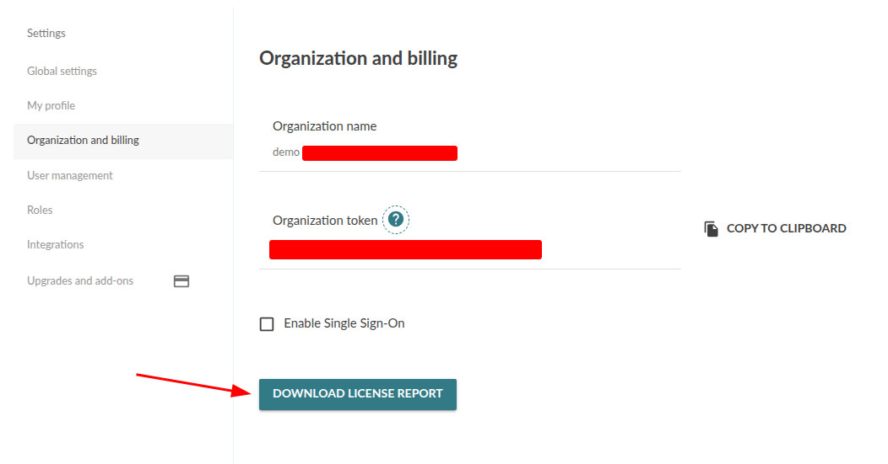

!!!!! Device License Count is only available in Mender Enterprise.
!!!!! Ignore this section if you are running Mender Open Source.

The Device Authentication service gathers data about devices. It also provides a command
to count the number of accepted devices and store it as licensing data: `license-count`.

```shell
# deviceauth license-count --help
NAME:
   deviceauth license-count - Count licenses and store the results

USAGE:
   deviceauth license-count [arguments...]

DESCRIPTION:
   Counts the devices licenses and stores the result for later processing.
```

It saves the device count daily for future inspection and otherwise does not influence the operations of the Mender Server in any way.

For production installations with Kubernetes, the cronjob is already prepared and will be running daily
<!--AUTOVERSION: "at [3am](https://github.com/mendersoftware/mender-helm/blob/%/mender/templates/device-auth-cron-license-count.yaml)."/ignore-->
at [3am](https://github.com/mendersoftware/mender-helm/blob/master/mender/templates/device-auth/cronjob_license_count.yaml).

You can download the device count and licenses report from the Mender UI in the Organization view by clicking on the link "Download license report":



Alternatively, if you have kubernetes access, you can run the report yourself:

```bash
DEVICEAUTH_POD=$(kubectl get pod -l 'app.kubernetes.io/component=device-auth' -o name | head -1)

kubectl exec -it $DEVICEAUTH_POD -- /usr/bin/deviceauth license-count
```

The output will look like this:

```text
INFO[2025-05-30T13:51:02Z] scanning deviceauth-xxxxx database  caller="cmd.LicenseCount.countLicenses.func1@commands_enterprise.go:38"
INFO[2025-05-30T13:51:02Z] scanning deviceauth-xxxxx database finished; accepted devices count: 424242  caller="cmd.LicenseCount.countLicenses.func1@commands_enterprise.go:92"
INFO[2025-05-30T13:51:02Z] scanning deviceauth-yyyyy database  caller="cmd.LicenseCount.countLicenses.func1@commands_enterprise.go:38"
INFO[2025-05-30T13:51:02Z] scanning deviceauth-yyyyy database finished; accepted devices count: 4242  caller="cmd.LicenseCount.countLicenses.func1@commands_enterprise.go:92"
```

!!! If you have Mender Server installed with the Mender Helm Chart older than v6.4.3,
!!! then you need to activate the license counting cronjob by defining it in the `values.yaml` file:
!!! ```yaml
!!! device_license_count:
!!!   enabled: true
!!! ```
