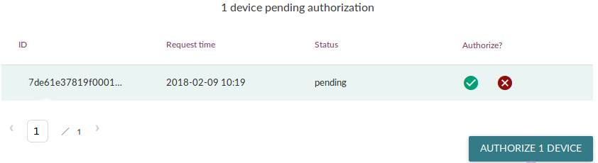

The Mender Server supports [preauthorizing devices](../../02.Overview/14.Device-authentication/docs.md#preauthorization-flow), where you add the [identity](../../02.Overview/07.Identity/docs.md) and public key of the device to the Mender Server before the device connects for the first time. This way the device is automatically authorized to join the Mender Server when it first connects. This is in particular useful in a mass production setting because you can preauthorize devices when they are manufactured so they automatically get accepted into the Mender Server when your customer turns them on, which might happen several months after manufacturing.

See [Device authentication](../../02.Overview/14.Device-authentication/docs.md) for a general overview of how device authentication works in Mender.


## Prerequisites


### A board integrated with Mender

You need a physical board that has already been integrated with Mender. For example, you may use one of the reference boards BeagleBone Black, Raspberry Pi 3 or Raspberry Pi 4.

If you have not yet prepared a device visit one of the following:

- [Client installation](../../03.Client-installation/chapter.md)
- [Operating System updates: Debian family](../../04.Operating-System-updates-Debian-family/chapter.md)
- [Operating System updates: Yocto Project](../../05.Operating-System-updates-Yocto-Project/chapter.md)

### The identity of your device

When preauthorizing a device you need to know its [identity](../../02.Overview/07.Identity/docs.md). This is one or more key-value attributes, depending on the identity scheme you are using. If you connect your device so it shows up as pending in the Mender Server, you will see its identity in the Mender Server UI. Note that preauthorization is *not* based on the ID of the device, only on the key-value attributes under Identity.

<!--AUTOVERSION: "mender/blob/%"/mender-->
By default the Mender Client uses the [MAC address of the first interface](https://github.com/mendersoftware/mender/blob/4.0.4/support/mender-device-identity?target=_blank) on the device as the device identity, for example `mac=02:12:61:13:6c:42`.


### Mender Client and Mender Server connectivity

Once your device boots with a newly provisioned disk image, it should already be correctly connecting to the Mender Server. After booting the device you should see it pending authorization in the Mender Server UI, similar to the following.



If your device does not show as pending authorization in the Mender Server once it boots with the disk image, you need to diagnose this issue before continuing. See the [troubleshooting section on connecting devices](../../301.Troubleshoot/05.Device-Runtime/docs.md#mender-server-connection-issues) in this case.


### A CLI environment for your Mender Server

In order to access the Mender Server API with the commands below, you need to set up some shell variables in the terminal you will be using.

Follow the steps in [set up shell variables for cURL](../01.Using-the-apis/docs.md#install-curl-and-jq-and-set-up-the-shell-variables).

### Mender-Artifact tool

Download the `mender-artifact` tool from the [Downloads section](../../10.Downloads/docs.md).

## Generate a client key pair

Before we preauthorize the device, we need its 1) identity and 2) public key. You should already know the identity of your device from the [prerequisite above](#the-identity-of-your-device).

We will generate the keys on a separate system (not on the device), and then provision them into the device storage. This way we can keep records of the public key of the device and ensure sufficient entropy during key generation, so the resulting keys are secure random.

!!! Make sure the system you generate keys on is adequately secured, as it will also generate the device private keys. You should consider securely deleting (e.g. `shred`) the *private* keys after provisioning the device if you do not truly need a record of them (you can keep the public keys).

We will use a script to generate a key pair the Mender Client understands; it uses the `openssl` command to generate the keys.

<!--AUTOVERSION: "mender/blob/%"/mender-->
Download the [keygen-client](https://github.com/mendersoftware/mender/blob/4.0.4/support/keygen-client?target=_blank) script into a directory:

<!--AUTOVERSION: "mender/%"/mender-->
```bash
wget https://raw.githubusercontent.com/mendersoftware/mender/4.0.4/support/keygen-client
```

Ensure it is executable:

```bash
chmod +x keygen-client
```

Run it without parameters:

```bash
./keygen-client
```

You will find the generated Mender Client key pair in a subdirectory `keys-client-generated`:

```bash
keys-client-generated/
├── private.key
└── public.key
```

!!! In cases where you are generating multiple keys you can pass an environment variable `PREFIX_KEY` to the `keygen-client` script and run it several times. For example, `PREFIX_KEY=device001- ./keygen-client`, `PREFIX_KEY=device002- ./keygen-client`. This prevents overwriting existing keys by writing them to different files.


## Preauthorize your device

Now that we have the device's identity and public key, we will use the Mender Server management REST APIs to preauthorize it. You can review the API documentation in this [API chapter](../../200.Server-side-API/?target=_blank#management-apis).


### Make sure there are no existing authentication sets for your device

First make sure to power off your device, so it does not continuously appear as pending in your server.

We recommend that you ensure there are no records of your device in the server; open the Mender UI, then go to *Devices* to see if it is there, then *Decommission* it.

!! Please be advised that the Mender Server backend, consisting of microservices, is asynchronous by design.
!! If you run multiple pre-authorization requests together with many decommission operations,
!! it is possible that you may run into `409 Conflict` responses. It can mean that the decommission
!! device workflow has not finished when a new pre-authorization request for the same auth set arrived.
!! If, for some reason, you run into problems of that sort and there are data inconsistencies between the
!! different microservices but deviceauth has the current and up-to-date information on your devices,
!! you can use deviceauth command line to propagate the correct status, and device attributes.
!! See the `deviceauth --help` for details.

Secondly, To make sure that the device has no existing authentication sets, we check `devauth` service for the identity of your device.

In the same terminal, run the following command:

```bash
curl -H "Authorization: Bearer $JWT" $MENDER_SERVER_URI/api/management/v2/devauth/devices | jq '.' > /tmp/devauth.json
```

!!! To make the response more readable, we use the `jq` utility to decode it. If it is not available on your system you can omit this pipe or replace it with a different indentation tool (e.g `python -m json.tool`).

Now open the file `/tmp/devauth.json` and search for a value of your device identity (e.g. `02:12:61:13:6c:42` if you are using MAC addresses).

If you do not get any matches in either files, great! Continue to the [next section](#call-the-preauthorize-api).

If you do have one or more matches you must first delete these existing authentication sets. Find the `id` of the device, as well as the `id` of the authentication set, and use the `DELETE` method towards the service. For example, if you find the identity in `devauth.json` and you see the device has `id` `5ae3a39d3cd4d40001482a95` and the authentication set has `id` `17a1838b-1b48-470a-925e-0d2bf25bb09f`, then run the following command:

```bash
curl -H "Authorization: Bearer $JWT" -X DELETE $MENDER_SERVER_URI/api/management/v2/devauth/devices/5ae3a39d3cd4d40001482a95/auth/17a1838b-1b48-470a-925e-0d2bf25bb09f
```

If there is only one authentication set for the preauthorized device, the above
will also delete the device.

Now, re-run the command above to generate the `devauth.json` file again and verify that your device identity does not exist anywhere.

!!! Tip: when running Mender Server om-premise.
!!! In the event that the decommissioning operation fails, perform a [manual database cleanup via the provided CLI command](../../301.Troubleshoot/04.Mender-Server/docs.md#cleaning-up-the-deviceauth-database-after-device-decommissioning).

### Call the preauthorize API

Set your device identity as a JSON object in a shell variable:

```bash
DEVICE_IDENTITY_JSON_OBJECT_STRING='{"mac":"02:12:61:13:6c:42"}'
```

!!! Adjust the variable value to the actual identity of your device. If you have several identity attributes in your identity scheme, separate them with commas in JSON format inside this single object, for example `DEVICE_IDENTITY_JSON_OBJECT_STRING='{"mac":"02:12:61:13:6c:42", "serialnumber":"1928819"}'`.

Secondly, set the contents of the device public key you generated above in a second variable:

```bash
DEVICE_PUBLIC_KEY="$(cat keys-client-generated/public.key | awk 1 ORS='\\n')"
```

Then simply call the [API to preauthorize a device](../../200.Server-side-API/?target=_blank#management-api-device-authentication-preauthorize):

```bash
curl -H "Authorization: Bearer $JWT" -H "Content-Type: application/json" -X POST -d "{ \"identity_data\" : $DEVICE_IDENTITY_JSON_OBJECT_STRING, \"pubkey\" : \"$DEVICE_PUBLIC_KEY\" }" $MENDER_SERVER_URI/api/management/v2/devauth/devices
```

If there is no output from the command, this indicates it succeeded. To verify, list the currently registered authentication sets and make sure there is one for your device with the `preauthorized` status:

```bash
curl -H "Authorization: Bearer $JWT" $MENDER_SERVER_URI/api/management/v2/devauth/devices | jq '.'
```

Your device should now be preauthorized and accepted to the Mender Server once it connects with the exact same identity and key.


## Copy generated device key to disk image

Now that we have generated a key for the device and preauthorized it, we need to copy the generated *private* device key to our working disk image (it typically has the `.sdimg` suffix). We copy it to its default location `/mender/mender-agent.pem` on the data partition.

!!! There is a symlink from `/var/lib/mender/mender-agent.pem` on the root filesystems to `/mender/mender-agent.pem` on the data partition, which we will leave in place. If the Mender Client does not find a valid key it will generate one, which is not what we want when we are preauthorizing devices.

### Copy the private device key

Find the location of the [private key we generated](#generate-a-client-key-pair) and copy it into place on the data partition by running the following commands:

```bash
mender-artifact install -m 600 keys-client-generated/private.key mender-disk-image.sdimg:/data/mender/mender-agent.pem
```


## Boot the device

Now provision the storage with this new disk image, just like you have done in the past. If you are using a SD card, insert it into your workstation and use a command similar to the following:

```bash
sudo dd if=<PATH-TO-IMAGE>.sdimg of=<DEVICE> bs=1M && sudo sync
```

Then insert the SD card back into your device and boot it.


## Verify the device is accepted

If everything went as intended, your device will get the `accepted` status in the Mender Server. You can log in to the Mender UI to ensure your device is listed and reports inventory.

!!! Tip: when running Mender Server om-premise.
!!! If your device shows as `pending`, see the troubleshooting on [a device shows up as pending after preauthorizing it](../../301.Troubleshoot/04.Mender-Server/docs.md#a-device-shows-up-as-pending-after-preauthorizing-it).

If you do not see your device at all, verify it booted correctly and it is able to connect to the Mender Server. You can check [the Mender Client logs on the device](../../301.Troubleshoot/03.Mender-Client/docs.md#obtaining-client-logs) for more diagnostics information.
