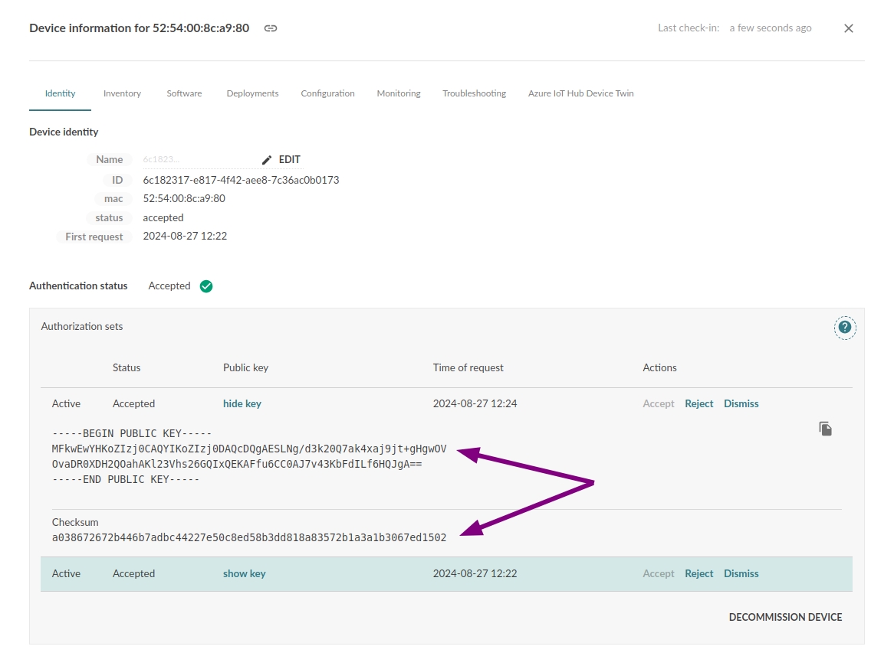

<!-- AUTOMATION: execute=if [ "$TEST_ENTERPRISE" -ne 1 ]; then echo "TEST_ENTERPRISE must be set to 1!"; exit 1; fi -->

<!-- Cleanup code: stops the Mender Gateway if running -->
<!-- AUTOMATION: execute=function cleanup() { -->
<!-- AUTOMATION: execute=docker stop mender-gateway 2>/dev/null && docker rm mender-gateway || true -->
<!-- AUTOMATION: execute=docker stop mender-client 2>/dev/null && docker rm mender-client || true -->
<!-- AUTOMATION: execute=} -->
<!-- AUTOMATION: execute=trap cleanup EXIT -->

## Prerequisites


### Environment and keys

You need to populate the [env variables](../01.Keys-and-certificates/docs.md#environment-variables) and have already [generated the keys](../01.Keys-and-certificates/docs.md#generating-the-keys).

## Set up the Mender Gateway

The steps below will run the `mender-gateway` server in mtls mode in a docker container.
It will consume the terminal but allow you to track the logs of the running server.


! Set the [env variables](../01.Keys-and-certificates/docs.md#environment-variables) and [generated the keys](../01.Keys-and-certificates/docs.md#generating-the-keys) before executing the commands below. The generated keys need to be in the current active directory when you run the commands.


As the `mender-gateway` container runs as user `nobody`, with UID 65534, we change the owner of the files we'll volume mount:

```bash
sudo chown 65534 $(pwd)/server.crt $(pwd)/server.key $(pwd)/ca.crt
sudo chmod 0600 $(pwd)/server.key
```

To start the edge proxy, run the following command:

```bash
docker run \
  -p $MENDER_GATEWAY_PORT:$MENDER_GATEWAY_PORT \
  --name mender-gateway \
  -e HTTPS_ENABLED="true" \
  -e HTTPS_LISTEN=":$MENDER_GATEWAY_PORT" \
  -e HTTPS_SERVER_CERTIFICATE="/etc/mender/certs/server/server.crt" \
  -e HTTPS_SERVER_KEY="/etc/mender/certs/server/server.key" \
  -e MTLS_CA_CERTIFICATE="/etc/mender/certs/tenant-ca/tenant.ca.pem" \
  -e MTLS_ENABLED="true" \
  -e MTLS_MENDER_PASSWORD="$MENDER_PASSWORD" \
  -e MTLS_MENDER_USERNAME="$MENDER_USERNAME" \
  -e UPSTREAM_SERVER_URL="$UPSTREAM_SERVER_URL" \
  -v $(pwd)/server.crt:/etc/mender/certs/server/server.crt \
  -v $(pwd)/server.key:/etc/mender/certs/server/server.key \
  -v $(pwd)/ca.crt:/etc/mender/certs/tenant-ca/tenant.ca.pem \
  $MENDER_GATEWAY_IMAGE --log-level debug
```

If something doesn't end up working with the above command you can return to the starting state with:

```bash
docker kill mender-gateway
docker rm mender-gateway
```

### Confirm communication with the proxy

Assuming you run the docker image on your host, the container will start listening to the host port 443.

! Set the [env variables](../01.Keys-and-certificates/docs.md#environment-variables) executing the commands below.
From a different terminal execute the command below:

``` bash
openssl s_client -connect $MENDER_GATEWAY_IP:$MENDER_GATEWAY_PORT

# In the mender-gateway terminal look for a line similar to:
# 2023/08/18 15:51:21 http: TLS handshake error from 192.168.88.249:46612: tls: client didn't provide a certificate
# This means you can communicate with the server correctly
```

## Configure the device to use the proxy

Now that we have generated a key and certificate for the device and signed the certificate, we need to configure the device to use the proxy.

We will use a virtual device with QEMU in docker. If you want to use a physical device, the procedure will be the same, just keep in mind you need to adjust the IP address accordingly.

Start the virtual client in daemon mode and confirm it's working:

! Set the [environment variables](../01.Keys-and-certificates/docs.md#environment-variables) and make sure you're in the directory where you [generated the keys](../01.Keys-and-certificates/docs.md#generating-the-keys).

! On a Linux device with kvm support you will get a much faster devices with `--privileged`.
! Do note that that comes with all the risks of running docker in privileged mode.

```bash
printf "\n\n"
docker run --name mender-client -d -it -p 85:85 --pull=always mendersoftware/mender-client-qemu && \
printf "\nWaiting 30s for the virtual client to boot\n" && \
sleep 30 && \
printf "\nChecking if the container started\n" && \
docker ps -f name=mender-client -q | grep '.' > /dev/null && \
printf "\n\nVirtual client started successfully\n" && \
CONTAINER_IP=$(docker inspect -f '{{range .NetworkSettings.Networks}}{{.IPAddress}}{{end}}' mender-client) && \
printf "\n\nContainer IP detected ($CONTAINER_IP) and assigned to variable (CONTAINER_IP)\n" && \
printf "\n\nTesting ssh access to Virtual client\n" && \
ssh -o UserKnownHostsFile=/dev/null -o ConnectTimeout=50 -o StrictHostKeyChecking=no -p 8822 root@$CONTAINER_IP  "echo 'Dummy SSH command executed'" &&
printf "\nVirtual device ready.\n"
```

If something doesn't end up working with the above command you can return to the starting state with:

``` bash
docker kill mender-client
docker rm mender-client
```


! For versions prior Mender client 4 replace `mender-authd` with `mender-client`


Update the device with new certificates: 

```bash
printf "\n\nCopying certificates on the device\n" && \
scp -o UserKnownHostsFile=/dev/null -o StrictHostKeyChecking=no -P 8822 device-private.key root@$CONTAINER_IP:/data/mender/mender-cert-private.pem  && \
scp -o UserKnownHostsFile=/dev/null -o StrictHostKeyChecking=no -P 8822 device-cert.pem root@$CONTAINER_IP:/data/mender/mender-cert.pem && \
scp -o UserKnownHostsFile=/dev/null -o StrictHostKeyChecking=no -P 8822 ca.crt root@$CONTAINER_IP:/usr/local/share/ca-certificates/mender/ca.crt && \
printf "\n\nMaking the device trust the new CE certificat\n" && \
ssh -o UserKnownHostsFile=/dev/null -o StrictHostKeyChecking=no -p 8822 root@$CONTAINER_IP update-ca-certificates && \
printf "\n\nCertificat installation succesfull\n"
```

Generate the new config:

``` bash
# Generate the new config
cat > mender.conf << EOF
{
  "InventoryPollIntervalSeconds": 5,
  "ServerURL": "https://$MENDER_GATEWAY_DOMAIN:${MENDER_GATEWAY_PORT:-443}",
  "TenantToken": "$TENANT_TOKEN",
  "UpdatePollIntervalSeconds": 5,
  "HttpsClient": {
    "Certificate": "/data/mender/mender-cert.pem",
    "Key": "/data/mender/mender-cert-private.pem"
  },
  "Security": {
    "AuthPrivateKey": "/data/mender/mender-cert-private.pem"
  }
}
EOF

cat > hosts << EOF
127.0.0.1   localhost.localdomain           localhost
$MENDER_GATEWAY_IP    $MENDER_GATEWAY_DOMAIN
EOF
```

Upload the new config and restart the Mender client:

```bash
ssh -o UserKnownHostsFile=/dev/null -o StrictHostKeyChecking=no -p 8822 root@$CONTAINER_IP systemctl stop mender-authd  && \
printf "\n\nmender-authd stopped\n" && \
scp -o UserKnownHostsFile=/dev/null -o StrictHostKeyChecking=no -P 8822 mender.conf root@$CONTAINER_IP:/etc/mender/mender.conf && \
scp -o UserKnownHostsFile=/dev/null -o StrictHostKeyChecking=no -P 8822 hosts root@$CONTAINER_IP:/etc/hosts
printf "\n\nNew config uploaded\n" && \
ssh -o UserKnownHostsFile=/dev/null -o StrictHostKeyChecking=no -p 8822 root@$CONTAINER_IP systemctl start mender-authd
printf "\n\nmender-authd started with the new config\n"
```


Since this change is the same on every device, it is natural to automate this as part of the build process for the disk image. 
See installation instructions for [the Debian family](../../../../04.Operating-System-updates-Debian-family/03.Customize-Mender/docs.md#configuration-file) or [the Yocto Project](../../../../05.Operating-System-updates-Yocto-Project/05.Customize-Mender/docs.md#configuration-file) for more information.

## Verify that the device is accepted

If everything went as intended, your device shows up with an `accepted` status in the Mender Server. 
You can log in to the Mender UI to ensure your device appears on the device list and reports inventory.

If your device is not showing up, make sure you installed the certificates correctly - both on the server and on the device. 
Check client logs and/or server logs for error messages that can identify what is wrong. 
See the [troubleshooting section on connecting devices](../../../../301.Troubleshoot/05.Device-Runtime/docs.md#mender-server-connection-issues) in this case.


## Key rotation 


If you have a security practice to exchange keys on the device as long as the new key is signed by the CA the gateway trusts, the device will reaccepted with the new key. It will have two pairs of accepted [auth sets](../../../../02.Overview/13.Device-authentication/docs.md#identification-and-authentication).

The examples below build on the evaluation example and will generate a new set of keys to deploy to the currently running device.


! Set the [environment variables](../01.Keys-and-certificates/docs.md#environment-variables) and make sure you're in the directory where you [generated the keys](../01.Keys-and-certificates/docs.md#generating-the-keys).
! Make sure the `$CONTAINER_IP` is still set


Generate a new keypair and sign it with the already created CA key:

```bash
# The NEW_KEY_IDENTIFIER is just a convenient helper to make it easy to distinguish between the keys. It is on no practical importance. 
NEW_KEY_IDENTIFIER=AAA
openssl ecparam -genkey -name P-256 -noout -out ${NEW_KEY_IDENTIFIER}_device-private-new.key && \
cat > ${NEW_KEY_IDENTIFIER}_device-cert-new.conf <<EOF
[req]
distinguished_name = req_distinguished_name
prompt = no

[req_distinguished_name]
commonName=$MENDER_GATEWAY_DOMAIN
organizationName=My Organization
organizationalUnitName=My Unit
emailAddress=myusername@example.com
countryName=NO
localityName=Oslo
stateOrProvinceName=Oslo
EOF
openssl req -new -key ${NEW_KEY_IDENTIFIER}_device-private-new.key -out ${NEW_KEY_IDENTIFIER}_device-cert-new.req -config ${NEW_KEY_IDENTIFIER}_device-cert-new.conf
openssl x509 -req -CA ca.crt -CAkey ca-private.key -CAcreateserial -in ${NEW_KEY_IDENTIFIER}_device-cert-new.req -out ${NEW_KEY_IDENTIFIER}_device-cert-new.pem -days $((365*10))
```

Upload the new key pair to the device and restart mender-authd:


```bash
ssh -o UserKnownHostsFile=/dev/null -o StrictHostKeyChecking=no -p 8822 root@$CONTAINER_IP systemctl stop mender-authd
scp -o UserKnownHostsFile=/dev/null -o StrictHostKeyChecking=no -P 8822 ${NEW_KEY_IDENTIFIER}_device-private-new.key root@$CONTAINER_IP:/data/mender/${NEW_KEY_IDENTIFIER}_device-private-new.pem
scp -o UserKnownHostsFile=/dev/null -o StrictHostKeyChecking=no -P 8822 ${NEW_KEY_IDENTIFIER}_device-cert-new.pem root@$CONTAINER_IP:/data/mender/${NEW_KEY_IDENTIFIER}_device-cert-new.pem
```

The new Mender client config with the new key:

``` bash
cat > mender.conf << EOF
{
  "InventoryPollIntervalSeconds": 5,
  "ServerURL": "https://$MENDER_GATEWAY_DOMAIN:${MENDER_GATEWAY_PORT:-443}",
  "TenantToken": "$TENANT_TOKEN",
  "UpdatePollIntervalSeconds": 5,
  "HttpsClient": {
    "Certificate": "/data/mender/${NEW_KEY_IDENTIFIER}_device-cert-new.pem",
    "Key": "/data/mender/${NEW_KEY_IDENTIFIER}_device-private-new.pem"
  },
  "Security": {
    "AuthPrivateKey": "/data/mender/${NEW_KEY_IDENTIFIER}_device-private-new.pem" 
  }

}
EOF
scp -o UserKnownHostsFile=/dev/null -o StrictHostKeyChecking=no -P 8822 mender.conf root@$CONTAINER_IP:/etc/mender/mender.conf
```

And start the services again:

``` bash
ssh -o UserKnownHostsFile=/dev/null -o StrictHostKeyChecking=no -p 8822 root@$CONTAINER_IP systemctl start mender-authd
```

Once the device starts again it will have two authorisation sets:




You can confirm that those are indeed the two keys you used by comparing them to the values in both certificates:


```bash
CERT=device-cert.pem
printf "\n\nPublic key info for $CERT\n" && openssl x509 -pubkey -noout -in $CERT && \
printf "\nChecksum\n" &&\
openssl x509 -pubkey -noout -in $CERT | openssl dgst -sha256 | awk '{print $2}'


CERT=${NEW_KEY_IDENTIFIER}_device-cert-new.pem
printf "\n\nPublic key info for $CERT\n" && openssl x509 -pubkey -noout -in $CERT && \
printf "\nChecksum\n" &&\
openssl x509 -pubkey -noout -in $CERT | openssl dgst -sha256 | awk '{print $2}'

# Example output:
# Public key info for device-cert.pem
# -----BEGIN PUBLIC KEY-----
# MFkwEwYHKoZIzj0CAQYIKoZIzj0DAQcDQgAESw92QY4lSisAshTIa4iZ87MVd4JM
# tTKDFi+XhOf8IXbsdWIFas/2zQB9H/LGVMCHYDjTiMzd/5vtx3VOxldDqA==
# -----END PUBLIC KEY-----
# 
# Checksum
# be14bfa2552bf9a7902e9f2ea0e7dd25d5173cb3bfa9cf1da6eb282c37c974c6
# 
# 
# Public key info for AAA_device-cert-new.pem
# -----BEGIN PUBLIC KEY-----
# MFkwEwYHKoZIzj0CAQYIKoZIzj0DAQcDQgAESLNg/d3k20Q7ak4xaj9jt+gHgwOV
# OvaDR0XDH2QOahAKl23Vhs26GQIxQEKAFfu6CC0AJ7v43KbFdILf6HQJgA==
# -----END PUBLIC KEY-----
# 
# Checksum
# a038672672b446b7adbc44227e50c8ed58b3dd818a83572b1a3a1b3067ed1502
```
