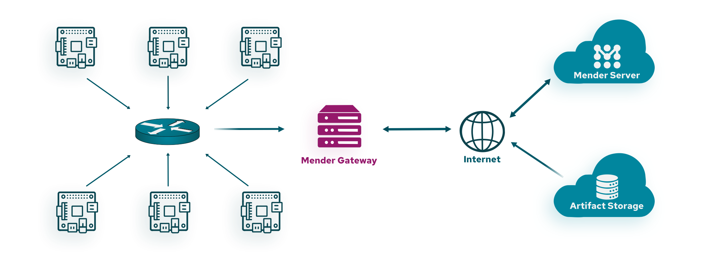

!!!!! Mender Gateway is only available in the Mender Enterprise plan.
!!!!! See [the Mender features page](https://mender.io/plans/features?target=_blank)
!!!!! for an overview of all Mender plans and features.

In segregated networks, most devices may operate without direct access to the
Internet. In such networks, typically only a gateway has Internet access and
offers a limited set of services to devices in the local network. _Mender
Gateway_ is such an application service that runs on the gateway and enables
managing and deploying OTA updates to devices on the local network. The gateway
acts as a proxy with the ability to understand and serve client requests
locally.

Mender Gateway operates by proxying requests from a local HTTP(S) server on the
local network to the upstream Mender server. It is capable of proxying artifacts
from an s3-compatible file server to the devices and enabling mutual TLS
authentication requests on behalf of devices.

## Artifact Proxy and Cache
The Mender Gateway can understand when a device has an available update
and serves artifacts on the server's behalf. Without this feature, the device
would try downloading the artifacts referenced by the download link contained
in the deployment instructions directly from the internet. The Mender Gateway
will instead replace the download link in the deployment instructions with a
local URL served by itself. It can also cache the artifacts locally and serve
them locally when needed. In this way, when multiple devices request the same
artifact, it will be downloaded only once and then served from the cache for
the subsequent download requests saving bandwidth. See the
[Mender Gateway User Guide](../../01.Get-started/06.Mender-Gateway/docs.md)
for a reference setup of Mender Gateway as an Artifact Proxy.

## Mutual TLS Authentication
The Mender Gateway is capable of automatic provisioning of devices using *mTLS*
authentication. Any device with a valid certificate signed by the Certificate
Authority (CA) configured on the gateway, is automatically accepted by the
Mender server. See the [mTLS user guide](../03.Mutual-TLS-authentication/docs.md) for a
reference mutual TLS setup in a testing environment.
