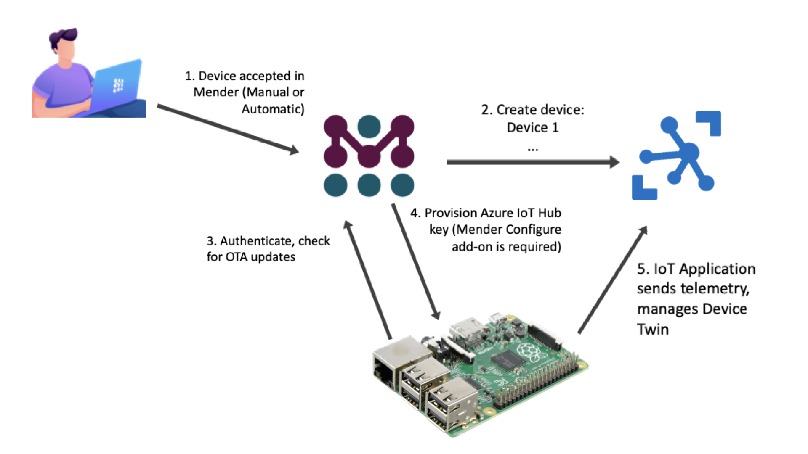
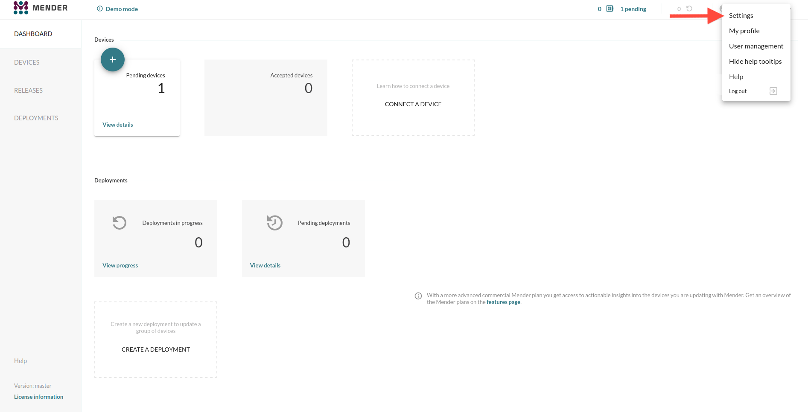
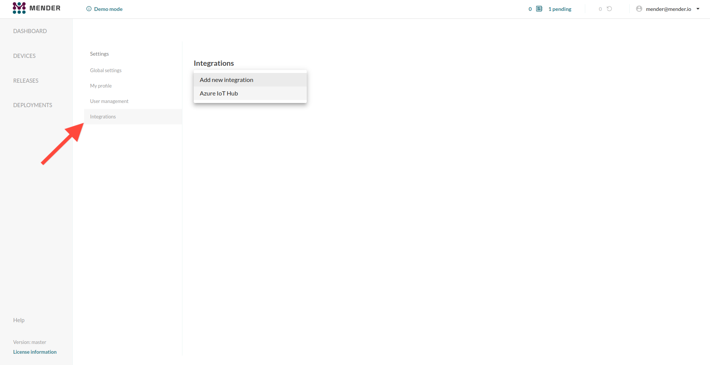
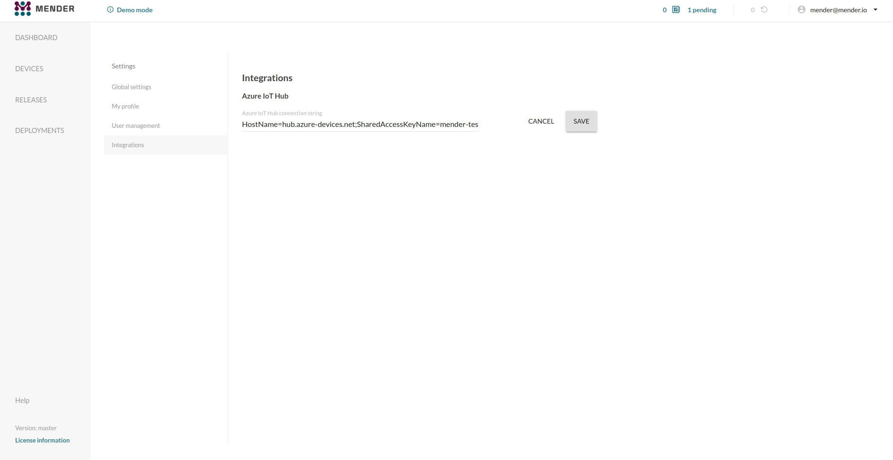
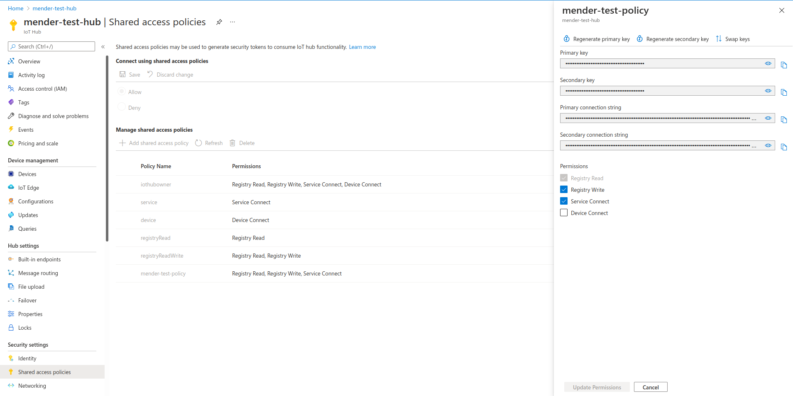
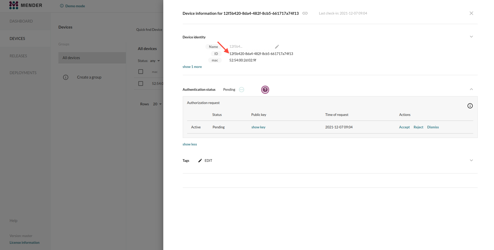
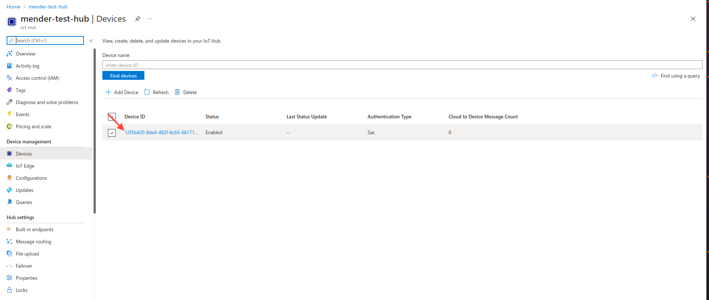
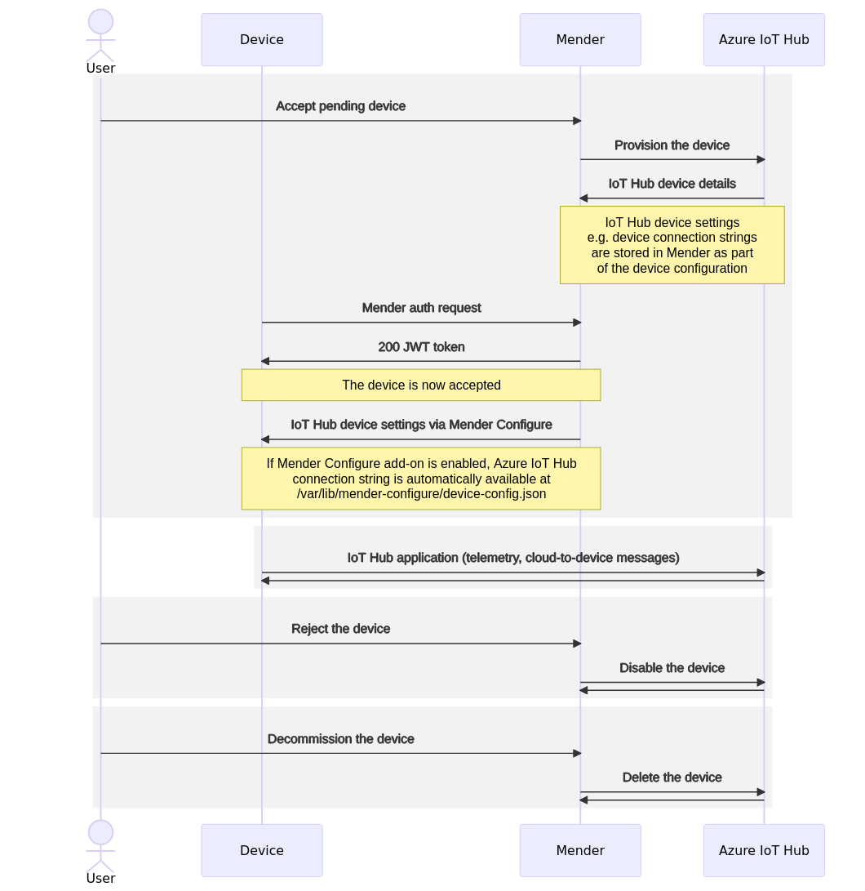
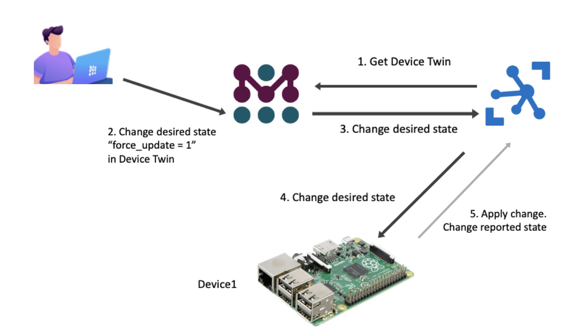
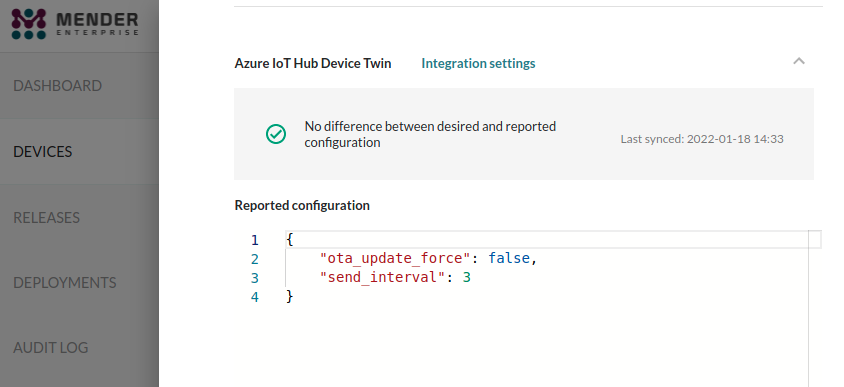

Mender supports preparing devices to use Azure IoT Hub. After installing Mender on the device it is automatically created in Azure IoT Hub, and applications running on the device get access to the Azure IoT connection string. With Mender in place, you can simply start writing your Azure IoT application by reading the connection string from a well-defined place on the device. Secondly, the Device Twin from the Azure IoT Hub becomes available to manage from Mender.

This integration is available in all Mender plans, as well as Mender Open Source.

!!!!! You need [Mender Configure](../../09.Add-ons/10.Configure/docs.md) to distribute the Azure IoT device connection strings to the devices.

!!! It is currently possible to have one Azure IoT Hub integration configured per Mender Organization (aka. tenant).

!!! After you enable the integration you can create devices in the Azure IoT Hub automatically through simply accepting them in the Mender UI. Existing devices (in both systems) are left unchanged.

## Prerequisites

### A Mender Server and device

You need a device integrated with Mender, see the [Get started guide](../../01.Get-started/01.Preparation/01.Prepare-a-Raspberry-Pi-device/docs.md).

### Azure IoT Hub

You need to set up an Azure account with Azure IoT Hub - see [Azure IoT Hub documentation](https://azure.microsoft.com/en-us/services/iot-hub/?target=_blank#overview) for more information. To integrate Mender with Azure IoT Hub you need to provide an [IoT Hub connection string](https://devblogs.microsoft.com/iotdev/understand-different-connection-strings-in-azure-iot-hub/?target=_blank#iothubconn).

## Configuring Mender to integrate with Azure IoT Hub

To connect your devices to Azure IoT Hub, you need to enter a connection string. Open the Mender UI and navigate to `Settings` -> `Integrations`:

Choose the Azure IoT Hub integration and enter your IoT Hub connection string:

You can find your connection string under the `Shared access policies` menu in your IoT Hub after selecting desired access policy:

!!! The `iothubowner` policy has the required permissions, but you can also use a more limited account if desired. Mender needs the `Shared access policy` with `Registry Read`, `Registry Write` and `Service Connect` permissions.

## Connect your devices to Azure IoT Hub automatically using Mender

Go to the `Devices` tab in Mender and accept a device. After it gets authorized in Mender, it will also show up in your Azure IoT Hub:

!!!!! Both Mender and Azure IoT Hub use the same Device ID. This makes it easy to cross-reference your devices between Mender and Azure IoT Hub.

From now on, your device can send data to Azure IoT Hub!

## Device lifecycle overview

In sum, the lifecycle of an Azure IoT Hub integrated device is:

1. At first, the device gets accepted - you can use various flows to achieve this state. See [device authentication](../../02.Overview/14.Device-authentication/docs.md) for more information.
2. Mender provisions the device in Azure IoT Hub - as a result of this operation, the Mender Server retrieves the Azure device connection string.
3. The Mender [Configure add-on](../../09.Add-ons/10.Configure/docs.md) sets the device connection string in file (`/var/lib/mender-configure/device-config.json`) on the device. We recommend to create a [Mender configuration script](../../09.Add-ons/10.Configure/01.Device-integration/docs.md) to reconfigure the Azure IoT application and restart it with its new connection string.
4. From now on, device applications can read the connection string from the file and communicate with Azure IoT Hub.
5. If the device gets `rejected` or `dismissed` in Mender, it is automatically set to `Disabled` state in Azure IoT Hub.
6. If the device gets `decommissioned`, it is automatically `Deleted` from Azure IoT Hub.

## Device Twin management

As an additional integration point, the Mender Server obtains the Device Twin of the devices from the Azure IoT Hub.
This means you can see and manage the Device Twin directly from Mender, together with everything else about the device.

The Device Twin is available through the Mender APIs and UI.

!!! Mender strips away the `$metadata` and `$version` keys from the Azure Device Twin
!!! because they are not indended to be changed by users. Thus these keys are not visible
!!! in the Mender UI nor API responses. They still exist in Azure IoT Hub, however.

## Role Based Access Control

!!!!! Role Based Access Control is only available in the Mender Enterprise plan.
!!!!! See [the Mender plans page](https://mender.io/pricing/plans?target=_blank)
!!!!! for an overview of all Mender plans and features.

*Admin* permission is required to set up the integraiton,
i.e. set the connection string of the Azure IoT Hub in Mender's Settings.

Role Based Access Control is also enforced for the Device Twin:
* To *see* the Device Twin you need *Read* permission to the device
* To *edit* the Device Twin you need *Admin* permission
