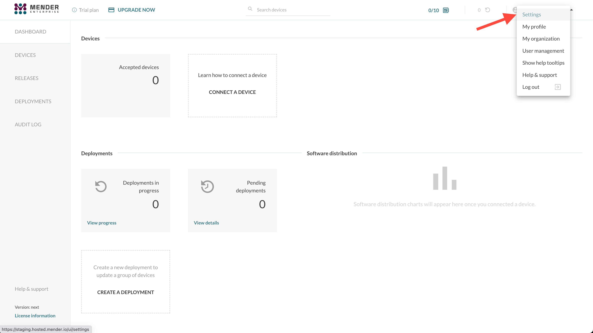
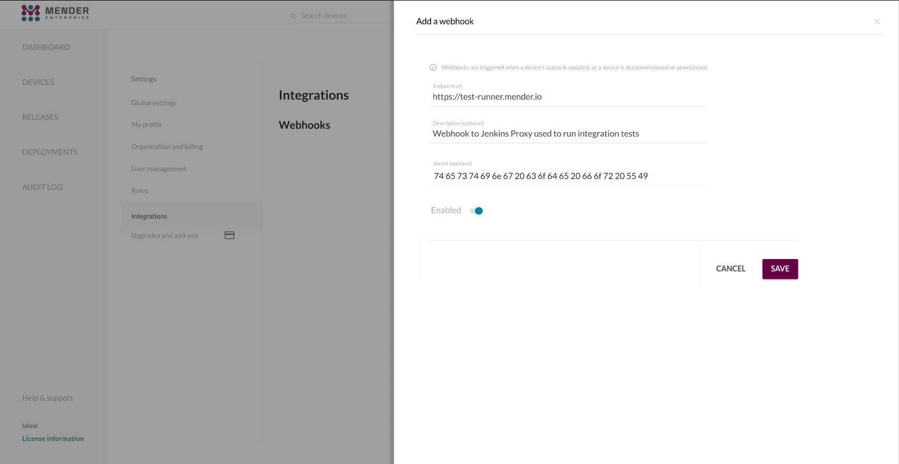
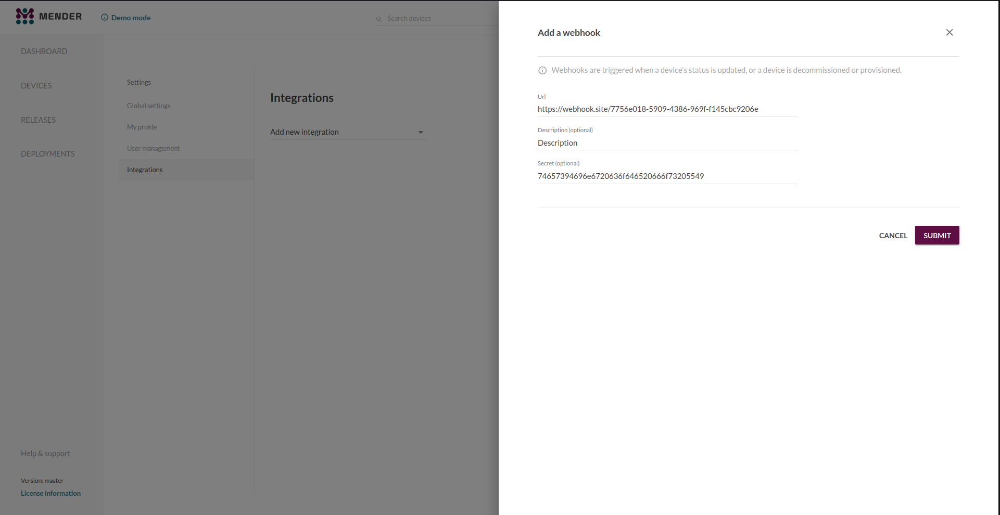
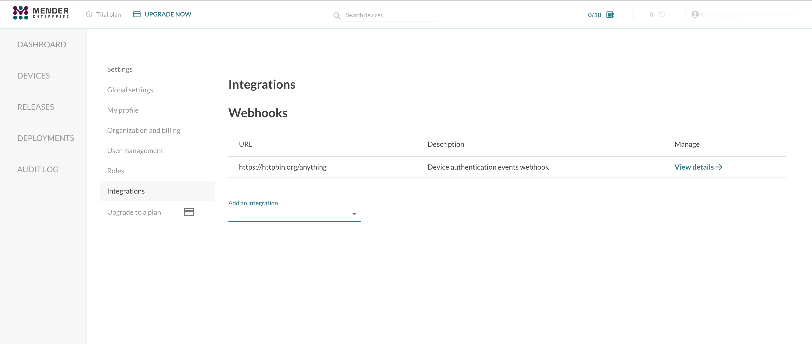
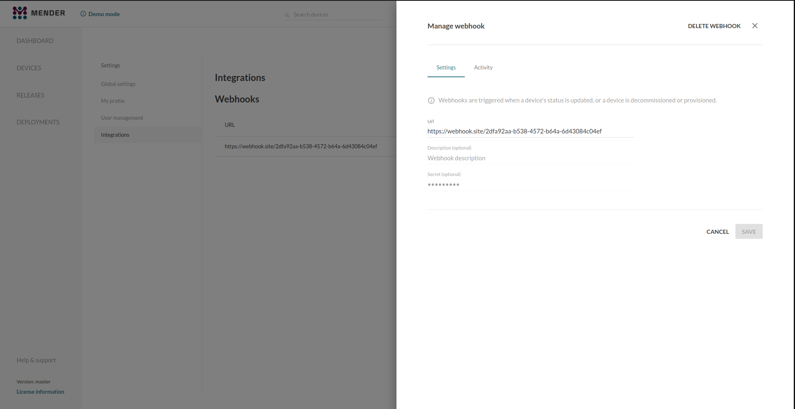
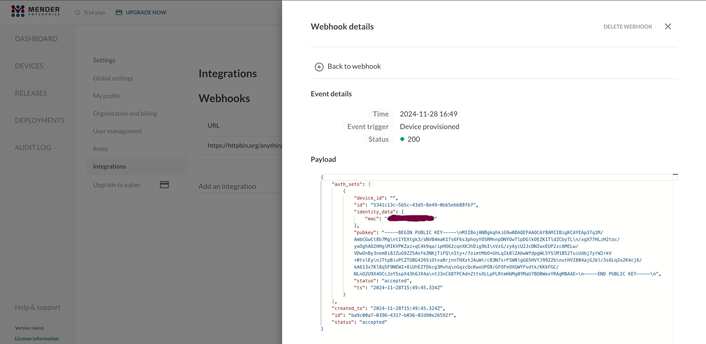

Mender supports Webhooks to send data to third-party systems. With this mechanism, it's possible to notify external applications about device lifecycle events. This helps you avoid polling and manual synchronization between Mender and other systems.

This integration is available in all Mender plans, as well as Mender Open Source.

## Prerequisites

### A Mender Server and device

You need a device integrated with Mender, see the [Get started guide](../../01.Get-started/01.Preparation/01.Prepare-a-Raspberry-Pi-device/docs.md).

### External service

You need an external service or application exposed on the internet and able to receive data from Mender in the form of an HTTP POST request.

## Supported events

### Device triggers

A Webhook fires on device lifecycle events:
* device provisioning,
* device decommissioning, or
* its authentication status changes.


## Configure and enable Webhooks in Mender

To send data from Mender to your application, you need to set up the integration by providing a unique URL and an optional secret.

Open the Mender UI and navigate to `Settings` -> `Integrations`:





Choose the `Webhooks` integration and enter your application URL and necessary credentials (optional):





After creating the Webhooks integration, you will see it in the integrations list.



You can see details of a given Webhook integration after proceeding to its details:



You can also see the Webhooks activity in the `Activity` tab:



## Events details

The event data sent to your application, depending on the event type, may look like this:

```json
{
  "id": "e57adf60-5d8c-4c66-802a-e0c5f643102a",
  "type": "device-status-changed",
  "data": {
    "id": "769e5a83-259c-4506-ab05-9c2564f196fd",
    "status": "accepted"
  },
  "time": "2022-09-13T10:03:47.746805235Z"
}
```

The list of allowed event types follows:
* `device-provisioned`
* `device-decommissioned`
* `device-status-changed`

The device authentication event consists of the following fields:
* `id` - device unique ID,
* `status` - the authentication status of the device,
* `auth_sets` - array of device authentication sets,
* `created_ts` - the time the device was initialized in Mender.

The properties included depend on the event type:
* device provisioning includes the entire device with the accepted authentication set, 
* status change events only include the device id and the new status, 
* device decommissioning will only include the device id.

More information about payload possibilities are available in the [iot-manager](https://github.com/mendersoftware/mender-server/tree/main/backend/services/iot-manager/?target=_blank) management API specification.

### Signature header

If you specify a secret, an integrity check is calculated and located in the `X-Men-Signature` header, which contains the HMAC-SHA256 of the payload using the configured secret.

## Role Based Access Control

!!!!! Role Based Access Control is only available in the Mender Enterprise plan.
!!!!! See [the Mender features page](https://mender.io/product/features?target=_blank)
!!!!! for an overview of all Mender plans and features.

*Admin* permission is required to set up the integration.
