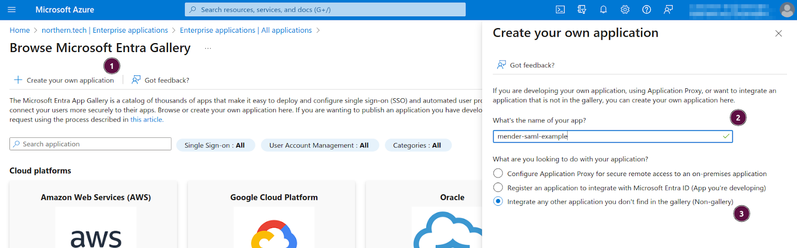
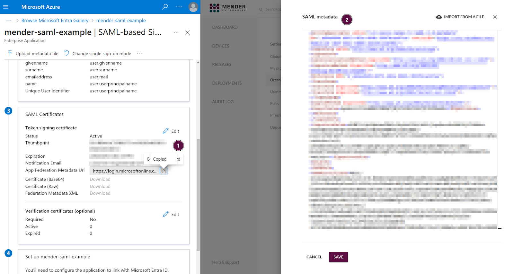
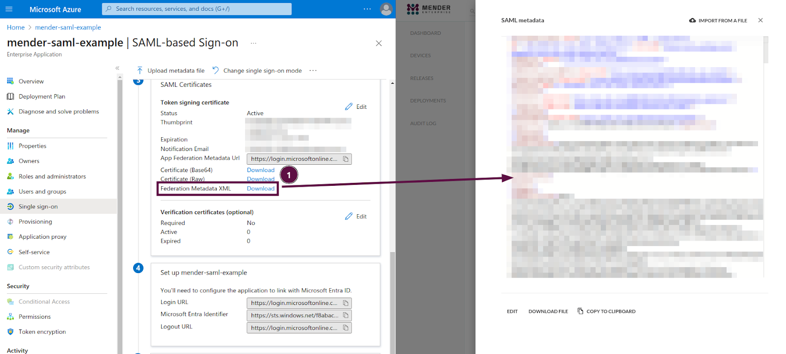
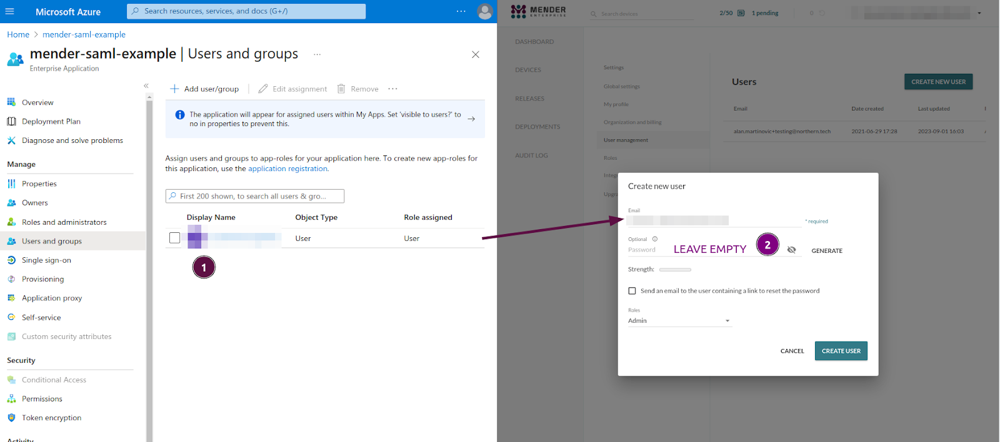

!!!!! SAML Federated Authentication is only available in the Mender Enterprise plan.
!!!!! See [the Mender features page](https://mender.io/product/features?target=_blank)
!!!!! for an overview of all Mender plans and features.

This example will show you how to set Azure Entra ID as an Identity Provider (IdP) for hosted Mender as a Service Provider (SP).

## Prerequisites

* Hosted Mender on a [free trial](https://mender.io/demo) or Enterprise plan.
* Azure Entra ID with the capability to create and customize a SAML enterprise application

## Setup

Under Azure Entra ID, select the creation of a new application. **(1)** 

Select the creation of your own application **(1)** 

Give it an arbitrary name **(2)** 

Select it as a non-gallery application **(3)** 

Select the setup for single sign-on. Select SAML on the next screen (no show in the picture). **(1)** 
 

At this point only the App Federation Metadata Url is available. This isn't a correct XML document, but it will serve as a placeholder until the real one is accessible.
Follow the link and copy the XML content. Please ensure to copy the raw XML.  **(1)**

In Mender, under `Settings -> Organization and billing` check the `Enable SAML single sign-on` and select `input text with text editor` (not visible in the picture).
Once the editor opens, paste the copied XML document into it. **(2)**

The URLs (`Entity ID`, `ASC URL`, and `Start URL`) will now be available under the SAML checkbox in Mender. **(1)**
Copy them into the Azure Entra ID application configuration. 

At this point, Azure Entra ID will allow the download of the real XML metadata. **(1)**
Replace the XML document you fetched from a URL in the previous step (App Federation Metadata Url) with the one you can download as a file (Federation Metadata XML).

In the `Users and groups` settings for the application in Azure Entra ID, assign the new user/group. **(1)**
The `User principal name` needs to be the same email that the user will have in Mender.
In Mender, create a new user with the Email corresponding to the `User principal name` set in Azure Entra ID.

Make sure no password is set during user creation otherwise the SAML integration will be rejected. **(2)**

## Testing and troubleshooting

Azure Entra ID offers a "Test" button in the "Single sign-on" section.
If you're logged to Azure Entra ID with the user you've set up in Mender, you can log out from Mender and press the "Test" button. 
If the integration is successful, you will be logged into Mender.

The other approach is to copy the Start URL (in Mender under `Settings -> Organization and billing` below the SAML checkbox) into your browser.
