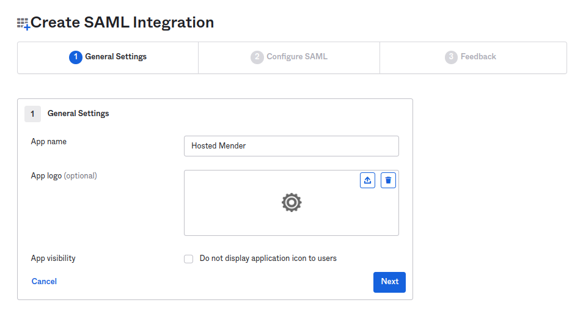
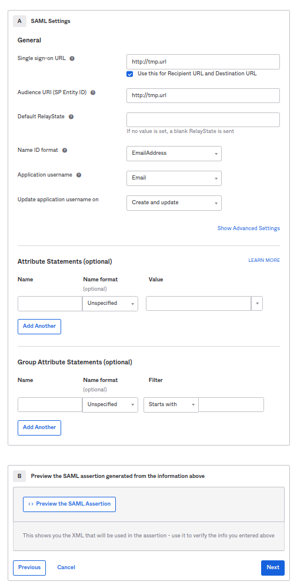

!!!!! SAML Federated Authentication is only available in the Mender Enterprise plan.
!!!!! See [the Mender plans page](https://mender.io/pricing/plans?target=_blank)
!!!!! for an overview of all Mender plans and features.

This example will show you how to set Okta as an Identity Provider (IdP) for hosted Mender.
The example is based on the free trial accounts on both services.

Create a free trial account for [Okta](https://www.okta.com/free-trial/) and [hosted Mender](https://hosted.mender.io/ui/signup).

## Initial setup on the Okta side

In the Okta Admin panel go to 
`Directory` -> `People` -> `Add Person` ([Okta - add users](https://help.okta.com/en-us/Content/Topics/users-groups-profiles/usgp-add-users.htm)).

In the Okta Admin panel go to `Applications` -> `Applications` -> `Create App Integration`.
Select `SAML 2.0` as the Sign-in method and proceed.
In the `General Settings`, set the app's name to `Hosted Mender` and proceed.

Set the following values in the `SAML Settings`, section `General`:

|         Field                                    |   Value          |
|--------------------------------------------------|------------------|
| `Single sign-on URL`                             | `http://tmp.url` |
| `Use this for Recipient URL and Destination URL` | `CHECKED`        |
| `Audience URI (SP Entity ID)`                    | `http://tmp.url` |
| `Name ID format`                                 | `EmailAddress`   |
| `Application username`                           | `Email`          |

The `http://tmp.url` are temporary values we'll later replace with the correct ones. 
This is a workaround to get Okta to generate the IdP metadata XML file.
Once you add the content of that XML to Mender, it will generate the correct URLs you will replace in Okta.
Proceed to the next screen.

[Assign mender to user](https://help.okta.com/en-us/Content/Topics/Provisioning/lcm/lcm-assign-app-user.htm)

Set the following values in the `SAML Settings`, section `General`:

|         Field                    |   Value                                                   |
|----------------------------------|-----------------------------------------------------------|
| `Are you a customer or partner?` | `I'm an Okta customer adding an internal app`             |
| `App type`                       | `This is an internal app that we have created` - `CHECKED`|

Press Next to conclude the setup.

[Assign](https://help.okta.com/en-us/Content/Topics/Provisioning/lcm/lcm-assign-app-user.htm) the newly created app integration the user created in the previous step.

Under the `Sign On` tab of the newly created "Hosted Mender" locate the `View SAML setup instructions` button and click on it.
Under the `Optional` there will be an XML containing the IdP metadata.
You need to copy that content to Mender.

## Setup on Mender

Copy the Okta IdP metadata generated in the previous step.

Once you copied the XML content, Mender will generate the required links.
You will use `Entity ID` and `ACS URL` to finalize the Okta configuration.
The `Start URL` is the URL to share with the user to log in once you complete the setup.

Before concluding the Okta setup with the correct values,
in Hosted Mender, from the upper left dropdown, select `User management` and click `Create new user`.
Then, give it the same email, and assign it a role, but **leave the password blank**.

## Concluding the Okta setup

Now it's time to return to Okta and replace the temporary URLs with the real ones.

| Field (Okta)                  |  Field (Mender) |   Value          |
|-------------------------------|-----------------|------------------|
| `Audience URI (SP Entity ID)` | `Entity ID`     | `https://hosted.mender.io/api/management/v1/useradm/sso/sp/metadata/6651b207-f809-553d-a64a-821874acb9a7` |
| `Single sign-on URL`          | `ACS URL`       | `https://hosted.mender.io/api/management/v1/useradm/auth/sso/6651b207-f809-553d-a64a-821874acb9a7/acs` |

Don't change any other values and conclude the editing of the application.
This ends the setup on the Okta side.

## Accessing the login

Copy the `Start URL` (the third URL provided by Mender) into the browser, and an Okta login will pop up.
Once you complete with the Okta authentication (you will have to install 'Okta Verify', the mobile app for Okta MFA), you will be redirected to Mender.
