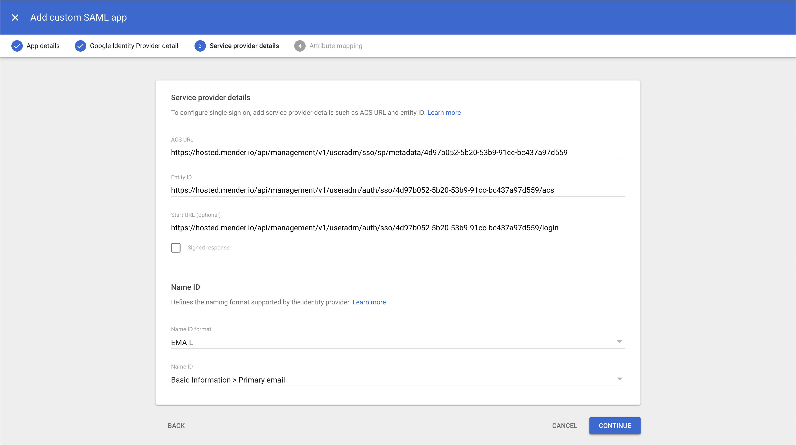

!!!!! SAML Federated Authentication is only available in the Mender Enterprise plan.
!!!!! See [the Mender plans page](https://mender.io/pricing/plans?target=_blank)
!!!!! for an overview of all Mender plans and features.

It is possible to configure a Mender tenant to leverage a SAML-compatible Identity Provider (IdP) to identify and authenticate users. Using SAML, users can log in to Mender using existing single sign-on credentials from services compatible with SAML 2.0, like Azure/Microsoft, AWS and Google.

## Configure Mender as a Service Provider

Setting up Mender as a SAML 2.0 Service Provider (SP) requires uploading the SAML metadata from your IdP in the "Organization and billing" settings view.


As Mender uses the user's email address as a username, please make sure your IdP uses the email address as NameID format.
You can verify it by checking the metadata XML you downloaded from your IdP and ensuring that it contains the following line:

```xml
<md:NameIDFormat>urn:oasis:names:tc:SAML:1.1:nameid-format:emailAddress</md:NameIDFormat>
```

Once the XML metadata file upload is complete, you will obtain the following information:

* Entity ID, a globally unique name for a SAML Service Provider (Mender, in our case);
* ACS URL, the Assertion Consumer Service URL your IdP will send its SAML Response after authenticating a user;
* Start URL (or Login URL), which will initiate the SAML authentication for your user.


## Add Mender to the Identity Provider

At this point, you can add Mender as a Service Provider to your Identity Provider. For example, in Google, you can add a new custom SAML app and specify the following settings:

* Application name;
* ACS URL;
* Entity ID;
* Start URL (optional).

Again, please ensure the NameID format is email and the Name ID value is the user's primary email address.



Once you registered the application in the IdP and enabled it for your users, the SAML Federation is complete, and you can start using it to authenticate your users to Mender.

## Authorizing users and federated log in

Only authorized users from your IdP can log in to Mender. 
For SAML integration you must authorize users by creating them in the "User management" settings view, leaving the password field blank and assigning the Role-Based Access Control roles as required.

At this point, users can log in to Mender by opening the Start URL in their browsers and logging in using their credentials from the organization's Identity Provider. The user will be automatically linked to the SAML IdP on the first login.


## Limitations

Please note that IdP initiated SSO isn't supported.


JWt tokens issued to SSO users authenticating to Mender through the SAML 2.0 federated login are valid for 24 hours only. The reason for this limitation is that Mender cannot check whether the user is still active and authorized when verifying the token on subsequent API calls. Therefore, after 24 hours, the user will have to authenticate again to renew the JWT token. However, if the session in the Identity Provider is still valid, this won't trigger a new password or token request, and the IdP will seamlessly redirect the user back to the Mender UI.

For the same reason, SSO users authenticating to Mender through the SAML 2.0 federated login cannot generate Personal Access Tokens. Please use password-based users to issue and manage Personal Access Tokens for programmatic integrations with the Mender management APIs.
