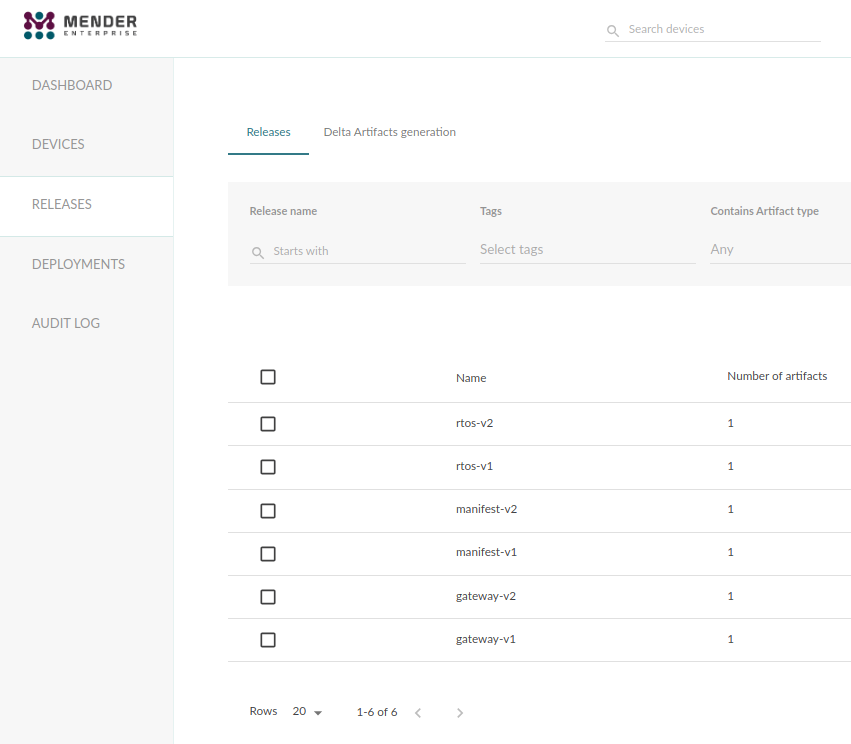
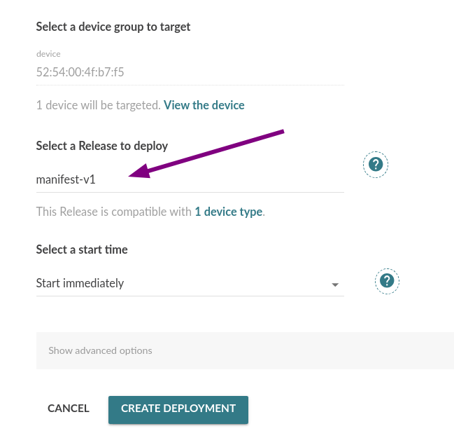
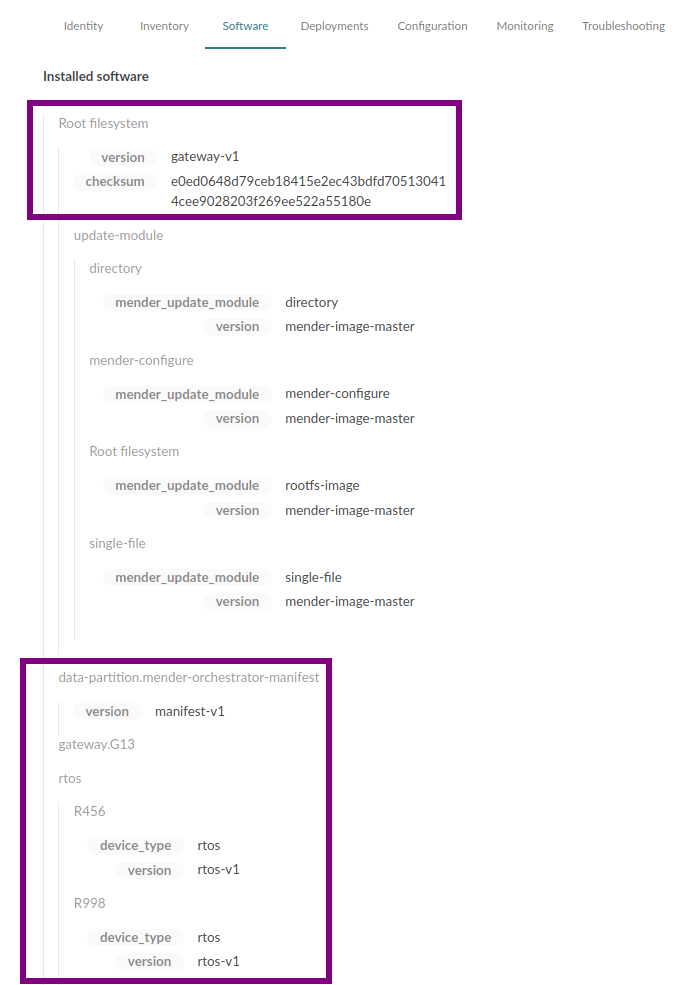
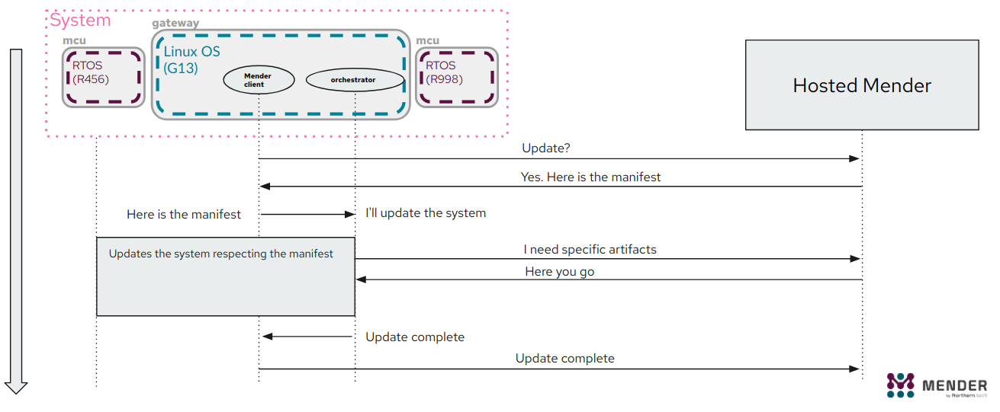
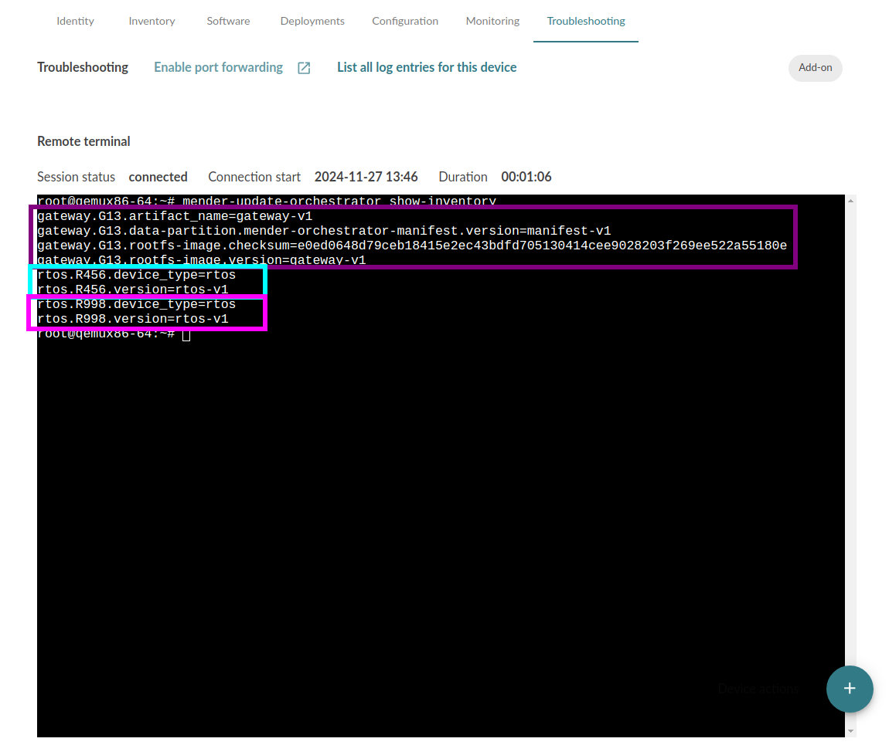
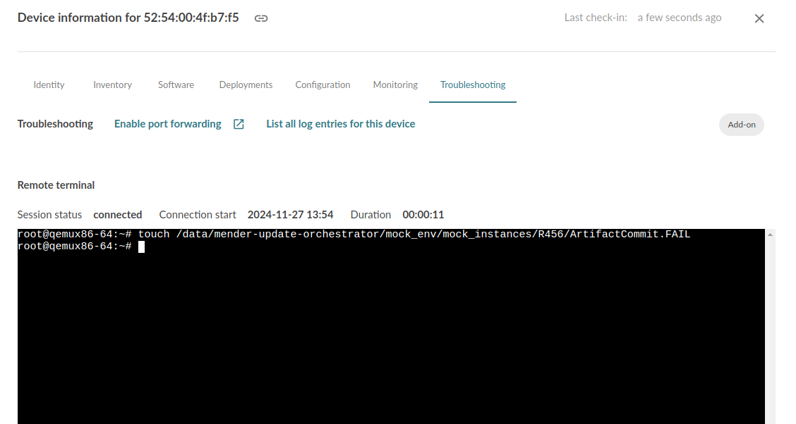
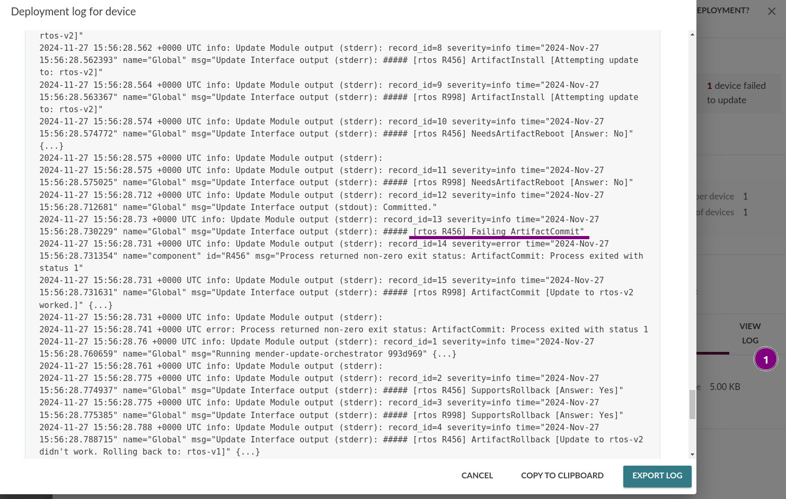
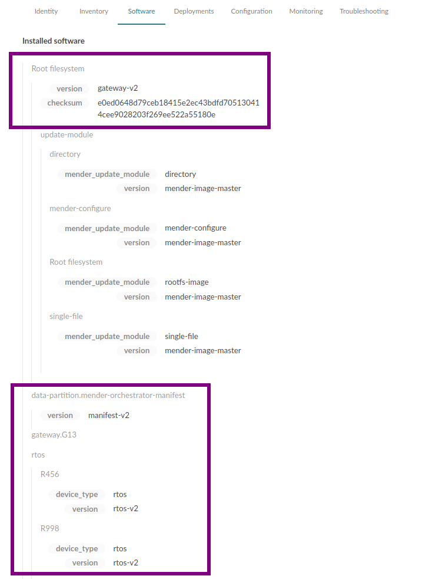

! The Orchestrator is not yet available for public evaluation, please [contact us](https://mender.io/contact?target=_blank) if you would like to learn more.


This section will explain how the Orchestrator works through copy-pastable working examples.

## Requirements

* you can run [mender-artifact](../../../10.Downloads/docs.md#mender-artifact) on your host
* you can run a Docker image on your host
* you have a hosted Mender tenant and can get a token
<!-- MEN-7215: Needs to be replaced with package install. -->
* you have the preview binary of the Mender Orchestrator software (please [contact us](https://mender.io/contact?target=_blank) to get this)


## Prepare the environment

Run this on the **host**:

```bash
mkdir orch-install
ORCH_EVAL_DIR=$(realpath orch-install)
mkdir -p $ORCH_EVAL_DIR/bin
```

<!-- MEN-7215: Needs to be replaced with package install. -->
Put the `mender-update-orchestrator` binary in the `orch-install/bin` folder.

Clone the repository which contains the support files and the demo:

```bash
git clone https://github.com/mendersoftware/mender-orchestrator-update-interfaces
```

Copy the pregenerated demo env and the interface:

``` bash
cp -r mender-orchestrator-update-interfaces/demo/pregenerated_env/* orch-install
cp -r mender-orchestrator-update-interfaces/interfaces/v1/rootfs-image  \
      $ORCH_EVAL_DIR/share/mender-update-orchestrator/update-interfaces/v1
```

Copy the update module and the inventory script:

```bash
mkdir -p $ORCH_EVAL_DIR/share/mender/modules/v3
cp mender-orchestrator-update-interfaces/modules/mender-orchestrator-manifest/module/v3/mender-orchestrator-manifest \
      $ORCH_EVAL_DIR/share/mender/modules/v3
mkdir -p $ORCH_EVAL_DIR/share/mender/inventory
cp mender-orchestrator-update-interfaces/inventory/mender-inventory-mender-orchestrator \
      $ORCH_EVAL_DIR/share/mender/inventory
```


## Preparing the QEMU host

The starting point for successfully completing the examples in this README is a clean `orch-install` directory ready.

### Manual installation on QEMU

The content of the orch-install directory is ready to be copied to the QEMU device.

Run the command below in a separate terminal on the host.
The command will run a virtual device and consume the terminal.
You have to set the tenant token from your tenant.

<!--AUTOVERSION: "mendersoftware/mender-client-qemu:mender-%"/integration-->
```bash
TENANT_TOKEN='<FILL WITH TOKEN>'

# Change this to eu.hosted.mender.io if you're in that zone.
SERVER_URL=https://hosted.mender.io

docker run -it -p 85:85 -e SERVER_URL=$SERVER_URL -e TENANT_TOKEN=$TENANT_TOKEN mendersoftware/mender-client-qemu:mender-master
```

Once the logging prompt shows, you can log in.
The username is root.


Once the device boots it will be visible in hosted Mender as pending.
Accept it.

With the previous terminal consumed by the virtual device, execute these commands on a different terminal on the **host**:

<!--AUTOVERSION: "mendersoftware/mender-client-qemu:mender-%"/integration-->
``` bash
IP_ADDRESS=$(docker inspect -f '{{range .NetworkSettings.Networks}}{{.IPAddress}}{{end}}' $(docker ps -aqf "ancestor=mendersoftware/mender-client-qemu:mender-master"))
# If you get multiple IPs use the alternative
# where you need to manually get the container id first
# docker ps
# CONTAINER_ID=<FILL IT>
# IP_ADDRESS=$(docker inspect -f '{{range .NetworkSettings.Networks}}{{.IPAddress}}{{end}}' $CONTAINER_ID)
```

Once you have the IP execute the command below on the **host**:

```bash
scp -r -o UserKnownHostsFile=/dev/null -o StrictHostKeyChecking=no -P 8822 orch-install root@$IP_ADDRESS:
```

On the **device**:


```bash
# Manually install the Orchestrator and the environment
orch-install/install_demo.sh
```

``` bash
# Test if the cli is executing correctly
mender-update-orchestrator -h
```

### Prepare the real rootfs Artifacts

The real rootfs update Artifacts will be created from runtime using the mender-artifact tool.

On the **device**

```bash
mkfifo /data/mender/dump
mender-snapshot dump > /data/mender/dump
```

The last command will not terminate, but will wait for you to execute commands from the host.

So back in the shell on the **host** where you have the variables form the Get Started guide, run:

``` bash
USER="root"
DEVICE_TYPE="qemux86-64"
TYPE="rootfs-image"


ssh -o UserKnownHostsFile=/dev/null  \
    -o StrictHostKeyChecking=no \
    -p 8822 root@${IP_ADDRESS} \
    cat /data/mender/dump > rootfs.ext4

# The ssh command on the host won't show progress but will block until complete
# If you switch to the device terminal you can see the progress.

mender-artifact write rootfs-image \
    -t "${DEVICE_TYPE}" \
    -n gateway-v1 \
    -o gateway-v1.mender \
    -f rootfs.ext4


mender-artifact write rootfs-image \
    -t "${DEVICE_TYPE}" \
    -n gateway-v2 \
    -o gateway-v2.mender \
    -f rootfs.ext4
```

As the result you now have gateway Artifacts generated (gateway-v1.mender, gateway-v2.mender). 
Go to your hosted Mender account and upload them under Releases.


Still on the **host** in the location where you cloned `mender-orchestrator-update-interfaces`, go to `mender-orchestrator-update-interfaces/demo/premade-artifacts` and upload the 4 Artifacts (`manifest-v1.mender  manifest-v2.mender  rtos-v1.mender  rtos-v2.mender`) from there as well. 


Once complete, your Releases list will look like this:



## Examples

In these examples we will update the root filesystem of the gateway where the Orchestrator runs, as
well as update two peripheral mock RTOS devices. 

! Before starting, please ensure that all the Artifacts have been uploaded to hosted Mender.


### Standard System update

In this example we will perform the update of the System using hosted Mender. 
This works just like a regular Mender deployment.

We are only deploying an Artifact containing the manifest.
The Orchestrator will download the other Artifacts from hosted Mender as they are needed.

Create a deployment to the device and select manifest-v1 as the Release.





From the perspective of the UI, the update will go through a standard process as how the Mender Client goes through.
Once completed, the new changes will be visible in the software tab.





#### What happened on the device

The following graph shows a higher level flow:





As part of the deployment, the Orchestrator received the new manifest.
Based on the Manifest the Orchestrator took the required steps to update the System.
This also meant downloading the Artifacts from hosted Mender directly.

Using the remote terminal we can see the state of the System from the device CLI as well:





### Component update failure

An update of a System can occasionally fail.
In that case it's almost always one component of a System that fails to update.
For those cases it's important for the System to a [healthy end state](../docs.md#end-state-constraints).

We're going to introduce an update failure in one of the components (R456).
Open the remote terminal and run the following command:

```bash
touch /data/mender-update-orchestrator/mock_env/mock_instances/R456/ArtifactCommit.FAIL
```



And start a deployment to manifest-v2.
Within 3 minutes the update will be shown as failed with the reason being the failure in R456.





If you were tracking the device, you might notices it rebooted twice.
This is because the component G13 (the Linux OS) was updated first and did so successfully.
After that the attempt to update the R456 took place and that failed.
As a result of that, the G13 had to be rolled back to the previous running version.


The versions of the System remain on v1:


To complete the update to v2, remove the failure by running the command below on the remove terminal:

```bash
rm -f /data/mender-update-orchestrator/mock_env/mock_instances/R456/ArtifactCommit.FAIL
```

And start an update to `manifest-v2` again.
The update will succeed this time and all the components will install on v2.



