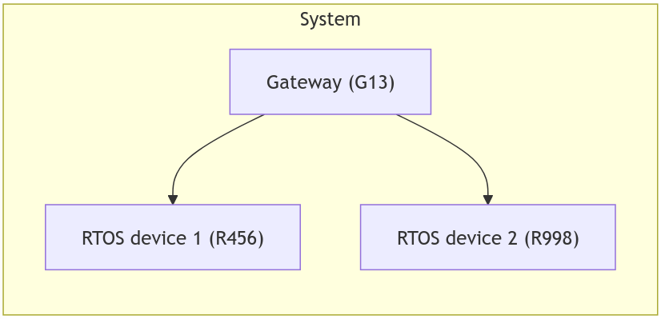
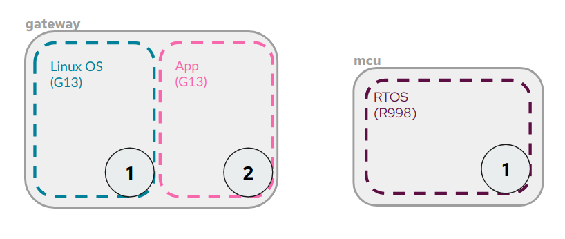
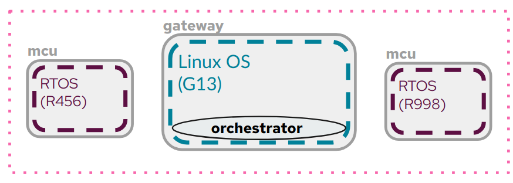
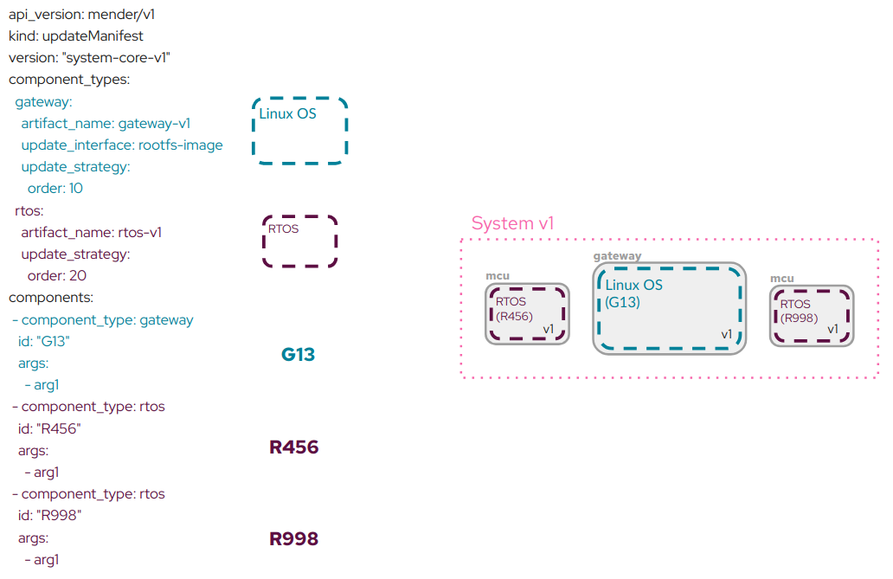
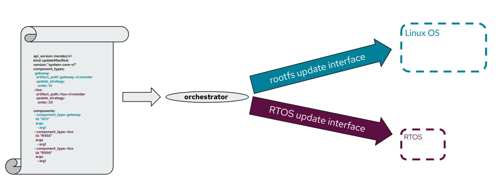

! The Orchestrator is not yet available for public evaluation, please [contact us](https://mender.io/contact?target=_blank) if you would like to learn more.

The Orchestrator is a tool to provide advanced Over the Air (OTA) updates to a whole System.


## Concepts

###  A System

A System is a combination of interdependent components running on multiple hardware boards that act together as a single product.

Examples of a System:
- a car consisting of multiple interconnected ECUs for infotainment, motor control, charging
- a drone with onboard sensors, GPS, a flight control computer, and communication modules 
- an edge device with different software components versioned independently


For the purpose of introducing the Orchestrator, the example System will consist of the following devices:


Linux Gateway G13:
* A device running Linux and having direct internet connectivity
* Can deliver updates to all other devices
* Has means to provide backward compatibility
    * Communicate with different RTOS versions
* Can fix (update) the RTOS
* Can fetch the  update content outside System boundaries


Two specialized Real-Time Operating System (RTOS) devices with no direct internet connectivity.
Besides running their specific function and having a rudimentary update System, there is not much they can do.

The IDs are arbitrary unique device names used to distinguish one from the other.


#### Components vs devices

A device can contain more than one software version or contain multiple logical components within a single hardware.
That is why, in the context of a System, we talk about components that have a software version regardless of how they map to devices.



The graph above shows a gateway (device) with two components (Linux OS, App).
You couldn't describe the gateway with a single software version.

On the other hand the mcu is a single component device.

For simplicity, the example System has a simple 1-1 mapping for devices.
The Linux gateway in the example is assumed to have the OS and application versioned and updated as a single component.

### Declarative approach to updates


Systems consist of multiple components, all of which need to be updated by respecting certain update constraints.
Two types of constraints exist:
* end state constraints - the acceptable combinations of versions the System components can be once the update completes
* transition state constraints - the acceptable combination of versions the System components can be in while transitioning from one end state to another

In an imperative approach used by the Mender Client, you would define a set of individual actions that need to take place for the System to update.
i.e.

```
Action 1 - Update the first System component from v1 to version v2
Action 2 - Update the second System component from v1 to v2
...
...
```

In the declarative approach, you specify the end state and the constraints, and the Orchestrator is in charge of defining and executing the steps.


### Constraints

#### End state constraints

An acceptable combination of versions representing a working version of a System.


| Gateway            | Rtos             | Acceptable | System version |
|--------------------|------------------|------------|----------------|
| gateway-v1.mender  | rtos-v1.mender   |   YES      |    v.1         |
| gateway-v1.mender  | rtos-v2.mender   |    NO      |    n/a         |
| gateway-v2.mender  | rtos-v1.mender   |    NO      |    n/a         |
| gateway-v2.mender  | rtos-v2.mender   |   YES      |    v.2         |


#### Transition state constraints

Because the Gateway is the more capable of the devices with the capacity to rollback on its own, it is the component that needs to update first.

An acceptable combination of versions to go through while transitioning to a valid end state of the System.


| Gateway           | Rtos            | Acceptable |
|-------------------|-----------------|------------|
| gateway-v1.mender | rtos-v1.mender  |   n/a      |
| gateway-v1.mender | rtos-v2.mender  |    NO      |
| gateway-v2.mender | rtos-v1.mender  |   YES      |
| gateway-v2.mender | rtos-v2.mender  |   n/a      |


#### Orchestrator runner

The Orchestrator is software that needs to be executed on some device within the System.
In the example case, the Linux Gateway is the obvious choice as it fits the update constraints.




## The Manifest

The Manifest is an instruction to the Orchestrator on how to update a System while respecting the update constraints.
Below is an example Manifest for the given System.




### Interface

An Interface is a command line application that serves as a translator between the updatable component and the Orchestrator. 
This decoupled design allows the Orchestrator to work with any custom set of steps a component needs to be updated. 



For details on the Interface protocol please [follow this link](50.Interface-protocol/docs.md).


### Manifests and Artifacts

For the Orchestrator to be able to update the System, it needs both Manifest and the Artifacts for the System components.
The Orchestrator is agnostic about the way it gets the required content.

For the default case, the Mender Client (in daemon mode, communicating with the Mender Server) will download the manifest as part of an update and the Orchestrator will pull the Artifacts it needs based on the manifest.

However it is also possible to deliver both the manifest and Artifacts to the Orchestrator in other ways (i.e. an USB stick) and have the System update happen unrelated to the Mender Server.


This concludes the concepts.
You can now head over to the [Installation section](01.Installation/docs.md) and then to [Examples](02.Examples/docs.md) to try it in practice.
