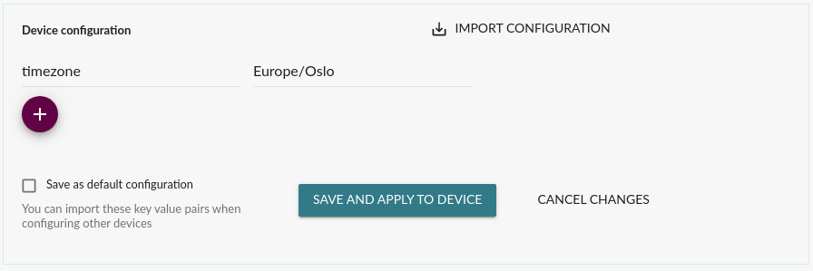

!!!!! The Mender Configure add-on package is required.
!!!!! See [the Mender features page](https://mender.io/product/features?target=_blank)
!!!!! for an overview of all Mender plans and features.

## Overview

Configure is a Mender add-on package that allows the application of the configuration to the device using Mender.
It is possible to create and apply configuration for the device using Mender UI (see the pictures below).





## How it works

Mender applies configuration in a similar way as software updates.
`deviceconfig` is a microservice on the server responsible for "translating" a configuration change made in the UI into a deployment.
It then proceeds to trigger a deployment to the device using the same mechanism used in OTA, the `deployments` microservice.

On the device side, a specialized update module is responsible for applying the configuration.
You can find more information about the configuration update module on [Mender Hub](https://hub.mender.io).
The picture below shows the configuration update flow.


## Requirements

There are no special device requirements for using Mender Configure, but editing the configuration
from the UI is not supported if the device is using **signed Artifacts**. It is still possible to
see reported configuration the UI. Configure Artifacts can be
deployed with a manually signed Artifact, by following the regular Artifact deployment flow as described in [Handle signed Artifacts](#handle-signed-artifacts).

## How to deploy a configuration to multiple devices at once

The `mender-configure` add-on was designed to be executed from the UI for one device at a time however, you can generate the artifact manually and then create deployments to groups (static or dynamic) taking advantage of the `mender-configure` Update Module:

### Prerequisite

You will need a script already located in `/usr/lib/mender-configure/apply-device-config.d` as described in ["How to make an apply-device-config script"](01.Device-integration/docs.md#how-to-write-an-apply-device-config-script) section of these docs.

### Create the `mender-configure` artifact

1. Create a json file that represents the key=value pair (In this example with the name `device-config.json`):

```json
{
    "key":"value"
}
```

2. Create an artifact with the following command, replace all the data between `<angle-brackets>`.

!!!!! Please note the `-m` flag points to the previously created file, this adds the json as metadata which is expected by the `mender-configure` Update Module on the device side.

```bash
mender-artifact write module-image  \
    -T "mender-configure" \
    -o "<an-artifact-name>.mender" \
    -n "<an-artifact-name>" \
    -t "<your-device-type>" \
    --software-version "<1>" \
    --software-filesystem "data-partition" \
    -m "device-config.json"
```

Then just upload it to the _Releases_ section of the Mender Server and you are ready to create the deployment in the _Deployment_ UI for groups of devices.

#### Handle signed Artifacts

You can take advantage of this approach to handle signed artifacts as you can include signatures from your workstation as opposed by using the Mender Configure UI per device to deploy a configuration. Just generate the key and add the `-k private.key` flag into the previous command as described in the [Artifact Signing section](../../06.Artifact-creation/07.Sign-and-verify/docs.md#signing).

The command should look something like this instead:

```bash
mender-artifact write module-image  \
    -T "mender-configure" \
    -o "<an-artifact-name>.mender" \
    -n "<an-artifact-name>" \
    -t "<your-device-type>" \
    --software-version "<1>" \
    --software-filesystem "data-partition" \
    -m "device-config.json" \
    -k "private.key"
```
