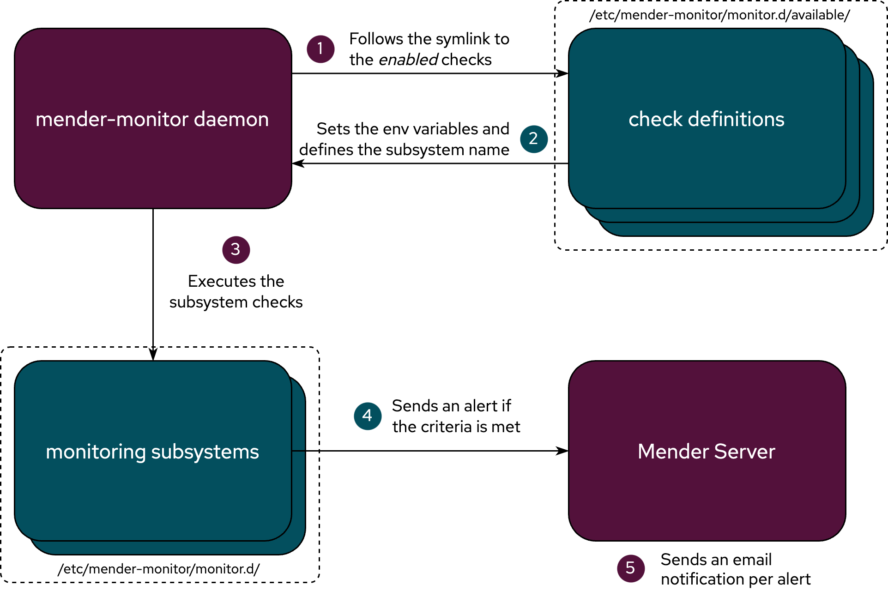

The Monitor add-on consists of two main parts:

- Server side - [Monitoring API endpoints](https://docs.mender.io/api/#devices-api-device-monitor)
- Client side - the `mender-monitor` systemd service running on the device


The `mender-monitor` service is responsible for detecting issues on the device.
A detected issue triggers an alert which is reported to the server using the API endpoints.

The server accepts the alerts and reports them to the fleet manager through the UI or email.


`mender-monitor` needs to provide a way to define a condition for an alert.
It does so with the combination of two components - subsystems and checks.  

A **monitoring subsystem** represents the generalized logic needed for detecting a specific type of event on a device.
For example, the logic to detect an error log in a log file is different from the one to detect a problematic D-Bus event.
The subsystem on its own doesn't have enough information to be executed.
This is where the checks come in.

A **check** contains the variable definitions needed for the subsystem to be executed. 

Putting it all together, the `mender-monitor` service sets the environment using the _check_ definition.
Then it executes the _monitoring subsystem_ for each check coupled with that subsystem.
If this results in a detection of a problem, an alert is sent to the server.
This is shown in the diagram below.



The supported way of using the monitoring add-on is to create the check for the supported subsystems which will detect the problematic events on the device.


## Creating custom Checks

The majority of monitoring use cases can be achieved by creating custom checks for the supported subsystems.

The way to work with Checks is using the CLI tool `mender-monitorctl`. You must to run `mender-monitorctl` with root privileges.

A check needs to be created first. 
You always create a check for a specific subsystem.

In the example below we're creating a check for the log subsystem.

```bash
#                       "Subsystem"     "Check name"          "Log Pattern"      "Log file"             "Duration of match validity [Optional]"
mender-monitorctl create    log         crasher_app             ERROR          /root/crasher.log                        5
```

The first two arguments are always the same - the subsystem and an arbitrary check name by which you'll reference it.
The variables after that are subsystem specific.
So `Pattern`, `Log file`, and `Duration of match validity [Optional]` are the variables needed for the log subsystem to operate.
Under the hood, a check is nothing more than a collection of those variables in a file with a name.


Once the check is created, it needs to be enabled before `mender-monitor` will start using it to detect issues.
To enable it we again reference both the subsystem and the check name

```bash
#                            "Subsystem"     "Check name" 
mender-monitorctl enable         log          crasher_app
```


The same pattern holds for disabling and deleting the checks.


```bash
mender-monitorctl disable log crasher_app
mender-monitorctl delete log crasher_app
```

Please proceed to read about the [supported subsystems](../30.Supported-subsystems/docs.md) which you can use to create custom checks.
