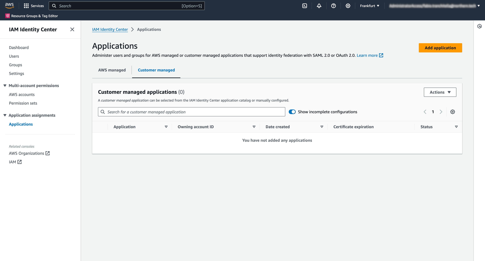
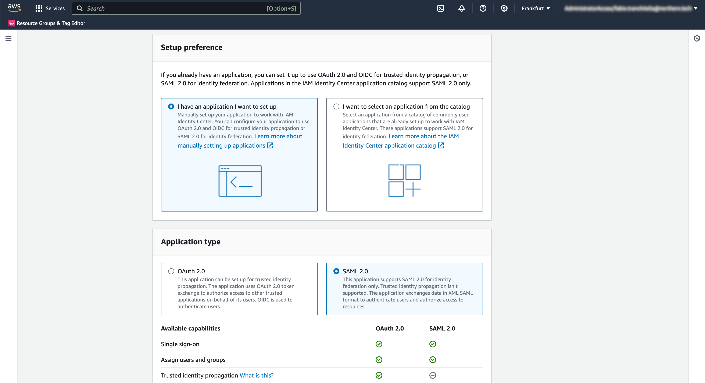
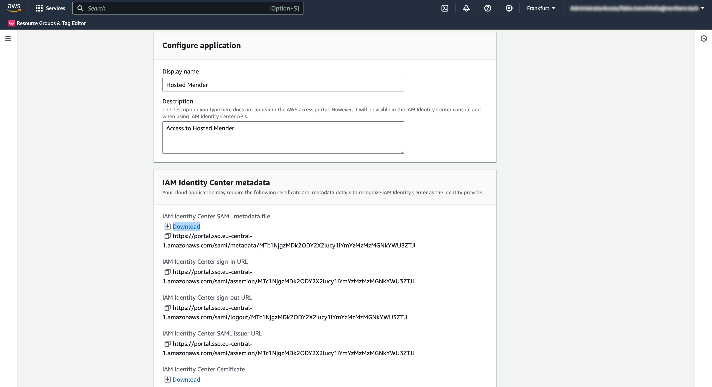
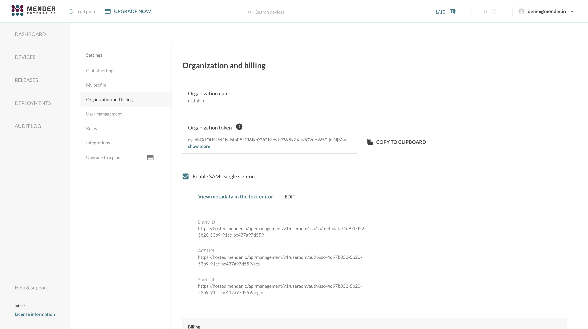
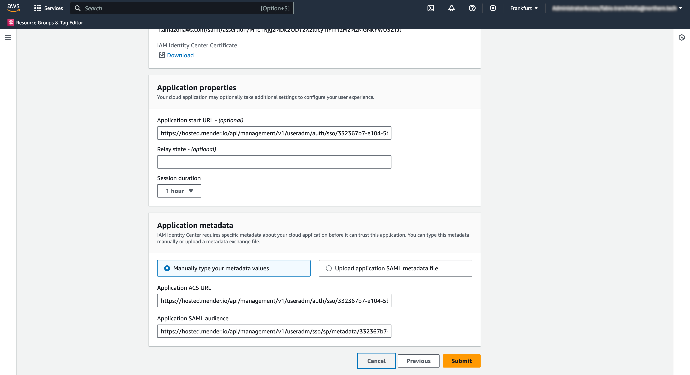
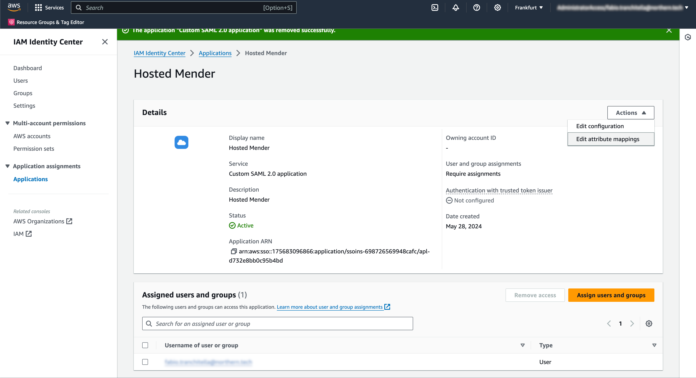
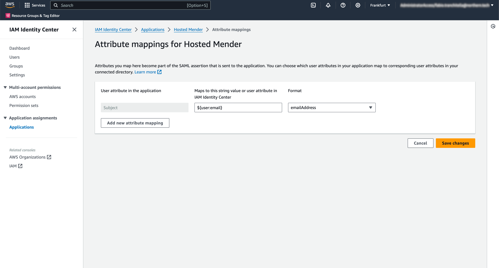
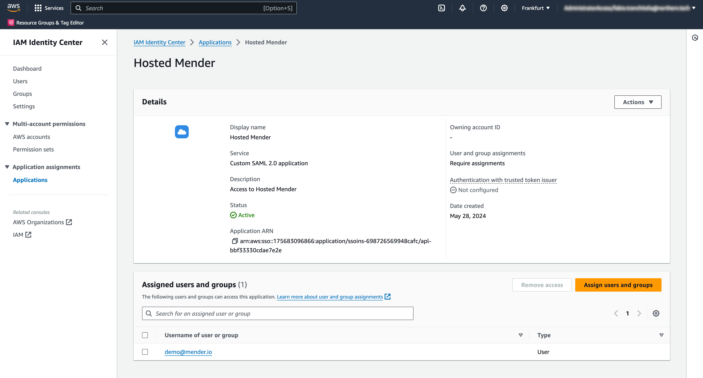
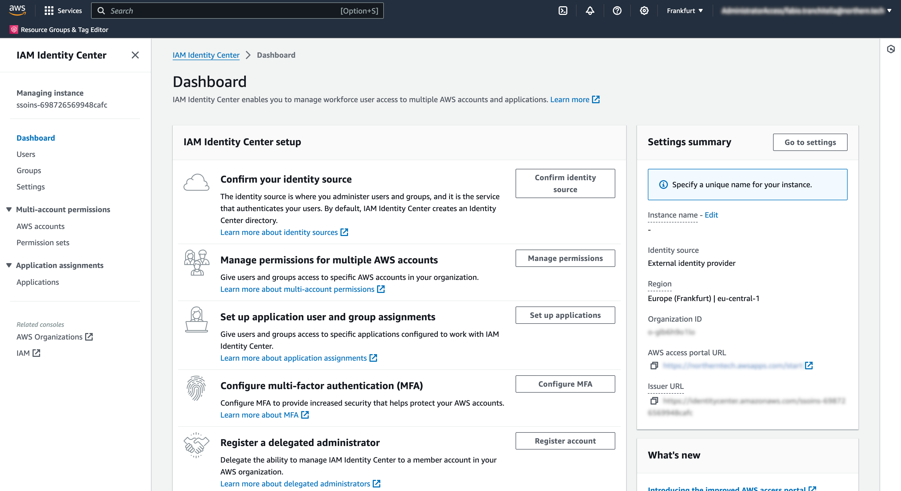
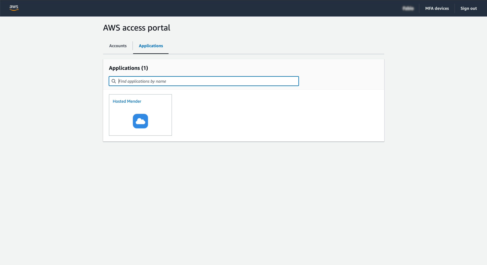

!!!!! SAML Federated Authentication is only available in the Mender Enterprise plan.
!!!!! See [the Mender plans page](https://mender.io/pricing/plans?target=_blank)
!!!!! for an overview of all Mender plans and features.

This example will show you how to set AWS IAM Identity Center as an Identity Provider (IdP) for hosted Mender as a Service Provider (SP).


## Prerequisites

* Hosted Mender Enterprise or a [free trial](https://mender.io/demo);
* An AWS account with enough privileges to create a customer managed SAML 2.0 application in the IAM Identity Center.


## Setup

### Create the customer managed SAML 2.0 application in the IAM Identity Center

* Open the IAM Identity Center console;
* Choose "Applications";
* Choose the "Customer managed" tab;
* Choose "Add application".



* Click on "I have an application I want to set up" and choose SAML 2.0;
* Click Next.



* Choose a Display Name (e.g., hosted Mender) and a description for your users;
* Download the IAM Identity Center SAML metadata file clicking on the "Download" link.

∏


### Configure Mender as a Service Provider

Go to your hosted Mender account in another browser tab to set up Mender as a SAML 2.0 Service Provider (SP).
This step requires uploading the SAML metadata we downloaded in the previous section in the "Organization and billing" settings view, selecting SAML as Single Sign-On type.


Once the XML metadata file upload is complete, you will obtain the following information:

* Entity ID, a globally unique name for a SAML Service Provider (Mender, in our case);
* ACS URL, the Assertion Consumer Service URL your IdP will send its SAML Response after authenticating a user;
* Start URL (or Login URL), which will initiate the SAML authentication for your user.



Please note these values and return to the other browser tab where you were setting up the AWS customer-managed SAML 2.0 application in the IAM Identity Center.


### Complete the creation of the customer managed SAML 2.0 application in the IAM Identity Center

* Enter the Mender's Start URL in the Application start URL field;
* Enter the Mender's ACS URL in the Application ACS URL field;
* Enter the Mender's Entity ID in the Application SAML audience field;
* Click "Submit" to complete the creation of the customer managed SAML 2.0 application.




### Edit the attribute mapping for the newly created application

As Mender looks up users using their email address, we must ensure that AWS IAM Identity Center uses the email address as NameID format.
To do so, we click on the "Edit attribute mappings" item from the "Actions" menu in the application details view:



In this screen, we set the "Subject" user attribute to the value `${user:email}` with format `emailAddress`, and we click on "Save changes".



!!!! Please note that this setting depends on the underlying Identity Provider configured for your AWS account. Please refer to the AWS documentation available by clicking on the "Learn more" link on this page to define the correct value for your specific setup.

At this point, we need to replace the AWS IAM Identity Center metadata in Mender. To do so, click the "Edit configuration" item from the "Actions" menu in the application details view.
We then scroll down to the "IAM Identity Center metadata" section and click on the "Download" link for the "IAM Identity Center SAML metadata file" field.

The newly downloaded XML will have the following line in it:

```xml
<md:NameIDFormat>urn:oasis:names:tc:SAML:1.1:nameid-format:emailAddress</md:NameIDFormat>
```

Lastly, we can proceed to replace the SAML metadata file in hosted Mender in the "Organization and billing" settings view, as explained above.
Please note that the Mender's SAML values (Start URL, ACS URL, Entity ID) won't change after you successfully upload the new SAML metadata file.


### Assign users and groups to the application

You must assign users and/or groups to the application to grant them access to hosted Mender.
You can do so by clicking the "Assign users and groups" button in the application's detail view.



Please note that to enable users to access your tenant on hosted Mender, you have to create that user with the email address corresponding to the email set in the AWS IAM Identity Center.
Ensure no password is set during user creation in Mender; otherwise, the SAML integration will be rejected.


### How to access hosted Mender using the AWS access portal

At this point, Mender's integration with AWS IAM Identity Center is complete, and you can access your hosted Mender account from the AWS access portal.
You can click the "Dashboard" link in the sidebar to obtain the AWS access portal URL and open it in a new tab.



From the AWS access portal, you will see hosted Mender in the list of "Applications".
To initiate the session, click on the application and proceed with the authentication.




## Additional documentation

For further information, you can refer to the AWS documentation about how to [Set up customer-managed SAML 2.0 applications](https://docs.aws.amazon.com/singlesignon/latest/userguide/customermanagedapps-saml2-setup.html).
