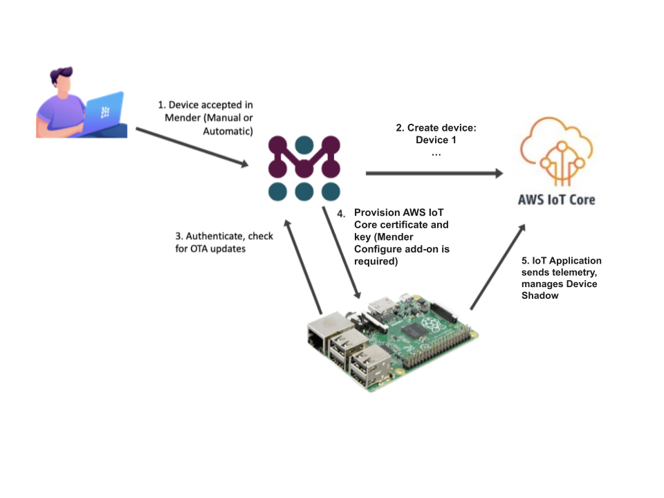
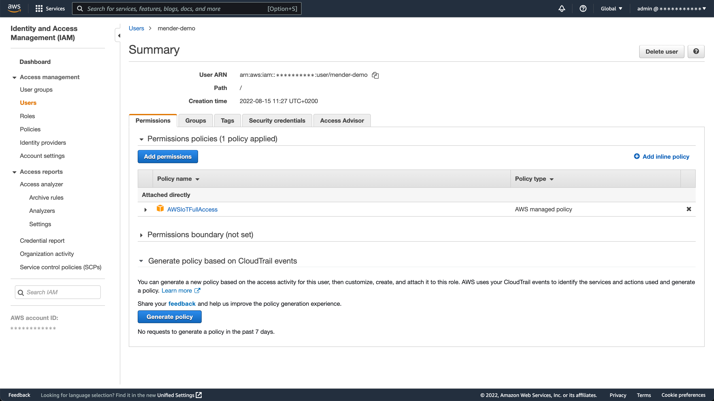
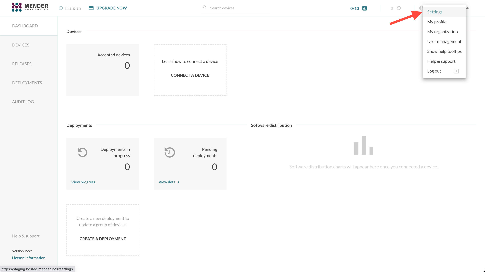
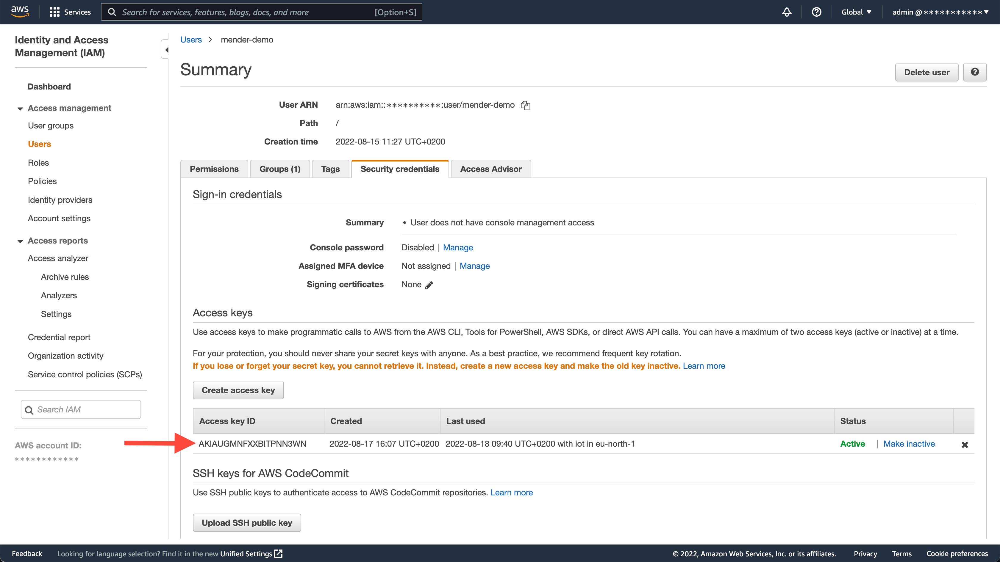
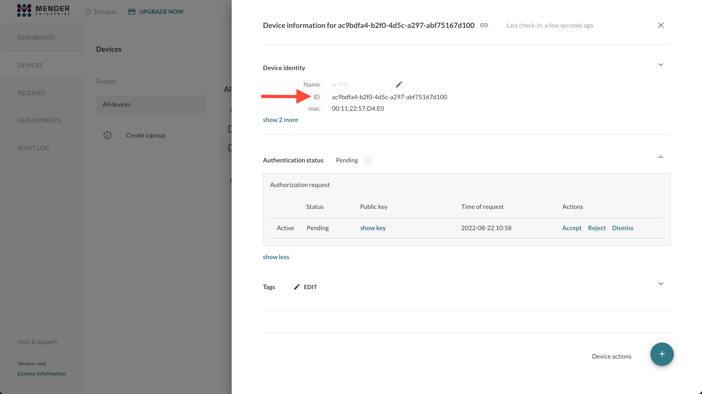
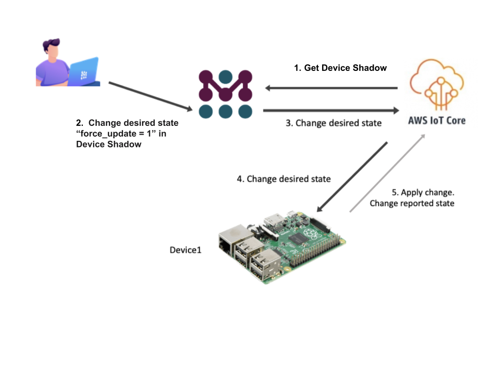

Mender supports preparing devices to use AWS IoT Core. After installing Mender on the device it is automatically created in AWS IoT Core and applications running on the device get access to it. With Mender, you can start writing your AWS IoT application by letting Mender manage the provisioning of the device certificate keys for IoT Core. Moreover, the Device Shadow is integrated into the Mender ecosystem letting you control the desired state and read the one reported by your devices in AWS.


This integration is available in all Mender plans, as well as Mender Open Source.

!!!!! You need [Mender Configure](../../11.Add-ons/10.Configure/docs.md) to distribute the AWS IoT Core keys and certificates to the devices.

!!! Note: Only one of [Azure](../05.Azure-IoT-Hub/docs.md), AWS, or [Webhooks](../07.Webhooks/docs.md) can be configured per Mender Organization (aka. tenant).

!!! After enabling the integration, Things in AWS IoT Core will be created automatically after the devices are accepted in the Mender UI. Existing Things and devices (in both systems) are left unchanged.




## Prerequisites

### A Mender Server and device

You need a device integrated with Mender, see the [Get started guide](../../01.Get-started/01.Preparation/01.Prepare-a-Raspberry-Pi-device/docs.md).

### AWS IoT Core

You need to set up an AWS account with AWS IoT Core - see [AWS IoT Core documentation](https://aws.amazon.com/iot-core/) for more information. To integrate Mender with AWS IoT Core you need to provide an [AWS IAM access key](https://docs.aws.amazon.com/IAM/latest/UserGuide/id_credentials_access-keys.html) for a user with enough privileges to manage AWS IoT Core - see [AWS Access management documentation](https://docs.aws.amazon.com/IAM/latest/UserGuide/access.html) for more information.

An IAM example policy with the minimal required permissions set follows:
```json
{
    "Version": "2012-10-17",
    "Statement": [
        {
            "Effect": "Allow",
            "Action": [
                "iot:AttachPolicy",
                "iot:AttachThingPrincipal",
                "iot:CreateCertificateFromCsr",
                "iot:CreatePolicy",
                "iot:CreateThing",
                "iot:DeleteCertificate",
                "iot:DeletePolicy",
                "iot:DeleteThing",
                "iot:DescribeAccountAuditConfiguration",
                "iot:DescribeCertificate",
                "iot:DescribeEndpoint",
                "iot:DescribeThing",
                "iot:DetachThingPrincipal",
                "iot:GetIndexingConfiguration",
                "iot:ListBillingGroups",
                "iot:ListScheduledAudits",
                "iot:ListThingGroups",
                "iot:ListThingGroupsForThing",
                "iot:ListThingPrincipals",
                "iot:ListThingTypes",
                "iot:ListThings",
                "iot:UpdateCertificate"
            ],
            "Resource": "*"
        }
    ]
}
```

!!! For getting started and demo purposes, you can use the `AWSIoTFullAccess` managed policy, which has extended privileges. However, we don't recommend it for production usage.



You also have to create an AWS IoT Core Device Policy. The policy will be attached to all accepted devices in the Mender UI.


An AWS IoT Policy example with extended permissions set for getting started and demo purposes follows:
```json
{
  "Version": "2012-10-17",
  "Statement": [
    {
      "Effect": "Allow",
      "Action": "iot:Connect",
      "Resource": "*"
    },
    {
      "Effect": "Allow",
      "Action": "iot:Publish",
      "Resource": "*"
    },
    {
      "Effect": "Allow",
      "Action": "iot:Receive",
      "Resource": "*"
    },
    {
      "Effect": "Allow",
      "Action": "iot:Subscribe",
      "Resource": "*"
    }
  ]
}
```

## Configuring Mender to integrate with AWS IoT Core

To connect your devices to AWS IoT Core, you need to set up the integration by providing an AWS IAM access key pair and specifying the AWS IoT Core Device Policy name.

Open the Mender UI and navigate to `Settings` -> `Integrations`:





Choose the `AWS IoT Core` integration and enter your IAM Key ID, Key Secret, Region and Device Policy Name:


You can create the AWS access keys from the `Security credentials` tab in the AWS IAM Users menu:



To attach IAM Policy to the AWS user in AWS Management Console go to `IAM` -> `Users` -> `<username>`, press `Add permissions` in `Permissions` tab and attach `AWSIoTFullAccess` existing policy directly.

!!! The `AWSIoTFullAccess` policy has all the required permissions, but we encourage you to use a more limited IAM policy.

## Connect your devices to AWS IoT Core automatically using Mender

Go to the `Devices` tab in Mender and accept a device. After it gets authorized in Mender, it will also show up in your AWS IoT Core:

!!! Both Mender and AWS IoT Core use the same Device ID. This makes it easy to cross-reference your devices between Mender and AWS IoT Core.



From now on, your device can send data to AWS IoT Core!

## Device lifecycle overview

The lifecycle of an AWS IoT Core integrated device is:

1. At first, the device gets accepted - you can use various flows to achieve this state. See [device authentication](../../02.Overview/14.Device-authentication/docs.md) for more information.
2. Mender provisions the device in AWS IoT Core - as a result of this operation, the Mender Server generates an [AWS IoT Core X.509 client certificate](https://docs.aws.amazon.com/iot/latest/developerguide/x509-client-certs.html) and registers it in AWS IoT Core.
3. The Mender [Configure add-on](../../11.Add-ons/10.Configure/docs.md) sets the Thing's private key and certificate in the file (`/var/lib/mender-configure/device-config.json`) on the device. We recommend creating a [Mender configuration script](../../11.Add-ons/10.Configure/01.Device-integration/docs.md) to reconfigure the AWS IoT application and restart it with these credentials.
4. From now on, device applications can read the private key and certificate from the file and communicate with AWS IoT Core.
5. If the device gets `rejected` or `dismissed`, Mender will automatically inactivate the certificate associated with the Thing in AWS IoT Core.
6. If the device gets `decommissioned`, the Thing and the related resources, including the certificate, are automatically `Deleted` from AWS IoT Core.


## Device Shadow management

The Mender Server integrates with IoT Core Device Shadow service.
This means you can see and manage the Device Shadow directly from Mender, together with everything else about the device.



The Device Shadow is available through the Mender APIs and UI.


!!! Mender strips away Device Shadow metadata from the AWS IoT Device Shadow because it's not indented to be changed by users. Thus, it's not visible in the Mender UI nor API responses. They still exist in AWS IoT Core, however.

## Role Based Access Control

!!!!! Role Based Access Control is only available in the Mender Enterprise plan.
!!!!! See [the Mender plans page](https://mender.io/pricing/plans?target=_blank)
!!!!! for an overview of all Mender plans and features.

*Admin* permission is required to set up the integration,
i.e. set the AWS access keys, region and device policy name for AWS IoT Core in the Mender's Settings.

Role Based Access Control is also enforced for the Device Shadow:
* To *see* the Device Shadow you need *Read* permission to the device
* To *edit* the Device Shadow desired state, you need *Admin* permission
