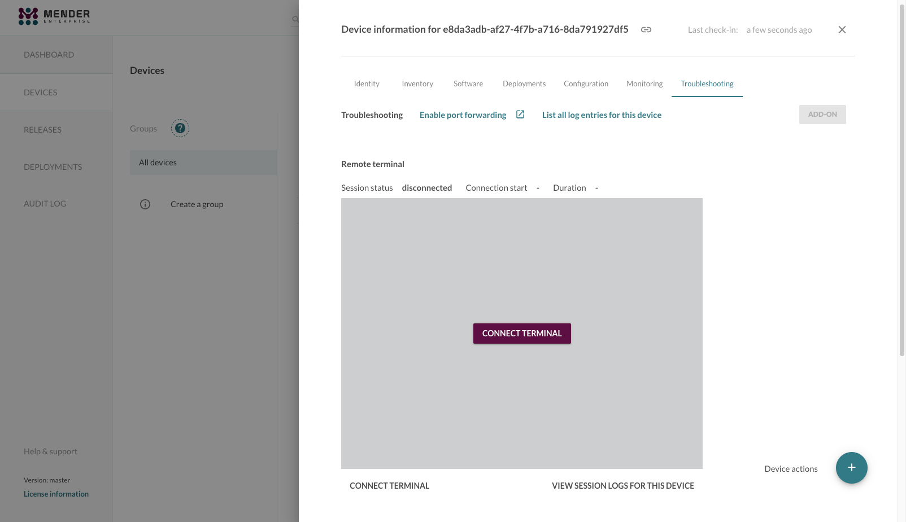
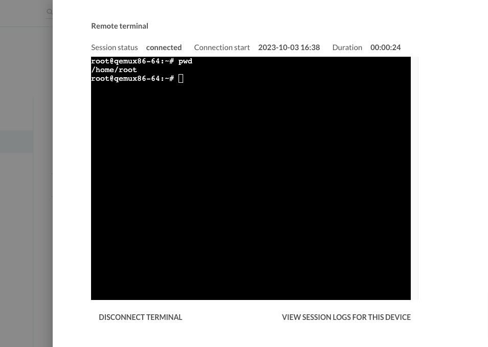
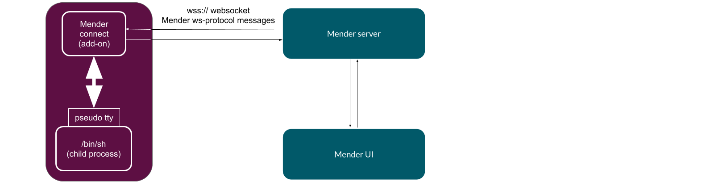

Remote Terminal is a Mender add-on allowing remote command execution
via interactive, live, fully functional terminal from the Mender UI.
You can start a terminal session to any connected
device by navigating to Troubleshooting in the device information, and clicking 
"Connect terminal" in the UI (see the picture below).



All you need is 
[mender-connect](../../12.Downloads/docs.md#remote-terminal-add-on)
configured and running alongside `mender-auth`, and you can
get a live terminal where you can freely type commands.



Every keystroke in the above popup window will go to the standard input
of a shell running on the device.

## No relation to SSH

Remote Terminal by Mender passes messages of a defined protocol over
a websocket connection. The two main actors: the `mender-connect` and Mender UI
communicate using a well-defined open protocol over a websocket connection.
They exchange messages which carry user keystrokes, terminal output,
and control data. Therefore, there is no relation to SSH and no part
of it is either used or required. You are, however, able to run sshd or ssh
command, since you have a fully functional terminal at your disposal.
Mender does not impose any additional restrictions on the commands,
shell, or terminal. The picture below shows a simplified architecture
with a websocket, `mender-connect`, and a shell running in a child process
of `mender-connect` with allocated pseudo tty.



## Loose coupling to Mender

There is a loose coupling between Mender and the add-ons like `mender-connect`.
Remote Terminal expects a certain well-defined DBus API to be in place
on a device, and a working websocket connection endpoint; none of these
have to come from or go to Mender.
As long as you send compatible messages over the websocket, `mender-connect` will work.
With Mender, however, you have everything in place, and all you need
is to perform a simple configuration of the client and start `mender-connect`.
Additionally, you can take advantage of the Role Based Access Control
and Audit Logs, since we fully integrated `mender-connect` add-on into Mender.

## Support for multiple users

The `mender-connect` supports simultaneous shells from different Mender users.
On the device, you run the shell as a system user which you can set
in the configuration.

An arbitrary number of users each running an arbitrary number of sessions
can easily lead to resources exhaustion on a device. To this end, `mender-connect`
imposes two configurable restrictions on:
* the total number of shells
* the number of sessions per user.

On the other hand, you can imagine a scenario when you reach
both limits and lock yourself out from the remote terminal.
In order to protect against this scenario, `mender-connect` supports automatic termination
of idle and/or expired sessions.

## Sessions and terminals

A remote terminal session consists of a spawned shell (as a subprocess of
the `mender-connect` process) a unique string called a session id, and a system username.
The main responsibility of the `mender-connect` executable
is to read messages from the websocket, route them by session id
to the correct shell, read the output going to the terminal,
and pass it upstream over the websocket.

For Mender Enterprise customers, Mender provides audit logging of all terminal
sessions. The audit logs include terminal creation/termination events as well as
the terminal output which users can later inspect from the
[AUDIT LOG](https://hosted.mender.io/ui/#/auditlog) panel in the Mender UI.

!!!!! Audit logs is only available in the Mender Enterprise plan.
!!!!! See [the Mender plans page](https://mender.io/pricing/plans?target=_blank)
!!!!! for an overview of all Mender plans and features.

## Using your own terminal

It is possible to use the remote terminal feature from you own terminal instead of the UI.
To achieve this please download the [mender-cli](../../12.Downloads/docs.md#mender-cli) tool.

You will need the Device ID and the access token, both accessible from the UI.
Device ID is available under the UI under `DEVICES -> select device -> Identity -> ID`.

For the access token you can use whatever way works best for you, a [PAT](../../10.Server-integration/01.Using-the-apis/docs.md#personal-access-tokens) or a session token (`Settings -> My profile -> Session token`) are the quickest.


``` bash
DEVICE_ID=<Fill with yours>
SESSION_TOKEN=<Fill with yours>

./mender-cli --server https://eu.hosted.mender.io --token-value $SESSION_TOKEN terminal $DEVICE_ID
```

As an alternative you can login with your user credentials and not need to specify the token.

```bash
DEVICE_ID=<Fill with yours>
./mender-cli --server https://eu.hosted.mender.io login
./mender-cli --server https://eu.hosted.mender.io terminal $DEVICE_ID
```

## Further reading

* For a detailed list of the configuration options please refer to the
[mender-connect configuration section](../90.Mender-Connect/docs.md#remote-terminal-configuration).
* You can find the `mender-connect` installation steps for Yocto-based projects,
and for Debian family,
in the [customize with Yocto](../../05.Operating-System-updates-Yocto-Project/05.Customize-Mender/docs.md#mender-connect),
and [customize with Debian](../../04.Operating-System-updates-Debian-family/03.Customize-Mender/docs.md) respectively.
