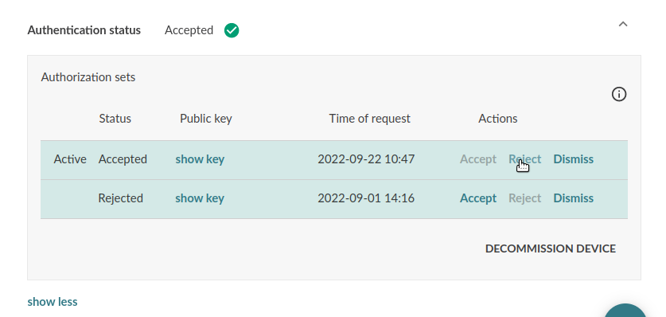

Mender team offers two public instances for the Mender software: [hosted
Mender](https://hosted.mender.io?target=_blank), which is located in USA, and [hosted
Mender](https://eu.hosted.mender.io?target=_blank), which is located in Europe.

This guide shows how to migrate deployed devices from hosted Mender (USA) to EU hosted Mender
(Europe).

!!!!! Migration to EU hosted Mender requires support assistance, and it is not possible to
!!!!! self-migrate from one location to the other. If you wish to migrate your tenant to EU hosted
!!!!! Mender please email [contact@mender.io](mailto:contact@mender.io) with your request.

!!! Mender currently supports these [regions](/11.General/00.Hosted-Mender-regions/docs.md).

## Introduction

The migration from one server to the other consists of three steps:
* From hosted Mender, deploy a software update to your devices which contains an updated
`mender.conf` file. This new configuration will use the `Servers` property to specify an array of
server URLs.
* Reject devices from the old server, so that the devices fallback to the new server once they get
Unauthorized error from the old server.
* From EU hosted Mender, deploy a new software update with a `mender.conf` containing only the new
server. This step is a formal clean-up and not urgent.

!!! Note that this method will not work on generic instances of the Mender server. It is only
!!! possible with hosted Mender and EU hosted Mender because the databases are internally
!!! synchronized for users performing the migration.

## Step 1: Deploy an update with the new Mender configuration

### Prepare the configuration file

The new configuration file must include the [`Servers`
field](../../03.Client-installation/07.Configuration-file/50.Configuration-options/docs.md#servers)
with an array of `ServerURL` that the device will use. The first element in the array must be the
old server (hosted Mender) and the second element must be the new server (EU hosted Mender).

The configuration file cannot include `ServerURL` field in the root.

Depending on how the original Mender configuration file was generated, this can be achieved in
different ways.

For Yocto project integrations, if you are already passing your own configuration file to the build,
as described in [Customize
Mender](../../05.System-updates-Yocto-Project/05.Customize-Mender/docs.md#configuration-file),
modify your `mender.conf` to include `Servers` array.

If instead you are relying on `meta-mender` to autogenerate a configuration file based on variables
you need to first capture the currently generated `mender.conf`, modify it, and use the [Customize
Mender](../../05.System-updates-Yocto-Project/05.Customize-Mender/docs.md#configuration-file) method
to inject it back into the build. The file can be captured from a live device or from yocto
`tmp/deploy/` directory (which will depend a bit on your setup).

Similarly for Debian family integrations, if you are already passing your own configuration file
with a [rootfs
overlay](../../04.System-updates-Debian-family/03.Customize-Mender/docs.md#configuration-file),
modify your `mender.conf` to include `Servers` array.

If instead you rely on the autogenerated `mender.conf`, capture it, modify it, and set it up in a
[rootfs
overlay](../../04.System-updates-Debian-family/03.Customize-Mender/docs.md#configuration-file).

The fields that need modification are:
* `ServerURL` shall be set to: `""` (empty string)
* `Servers` shall be set to: `[{ServerURL: "https://hosted.mender.io"}, {ServerURL: "https://eu.hosted.mender.io"}]`

You can do this manually with any text editor or using the `jq` command:

```
cat mender.conf | jq '
.ServerURL = "" |   # Blank existing ServerURL
.Servers = [        # Set Servers array of ServerURL(s)
  {ServerURL: "https://hosted.mender.io"},
  {ServerURL: "https://eu.hosted.mender.io"}
]' > mender.new.conf
```

To perform the configuration update, another option can be a custom [Update Module](https://docs.mender.io/artifact-creation/create-a-custom-update-module). The following code is an example for this Update Module:

``` bash
#!/bin/sh

set -e

STATE="$1"
FILES="$2"

case "$STATE" in
    ArtifactInstall)
        # Backup of current conf file
        cp /etc/mender/mender.conf /etc/mender/mender.old.conf

        # Modify current conf file
        cat /etc/mender/mender.conf | jq '
.ServerURL = "" |   # Blank existing ServerURL
.Servers = [        # Set Servers array of ServerURL(s)
  {ServerURL: "https://hosted.mender.io"},
  {ServerURL: "https://eu.hosted.mender.io"}
]' > /etc/mender/mender.new.conf

        # Set the new configuration
        cp -f /etc/mender/mender.new.conf /etc/mender/mender.conf
        ;;
    
    NeedsArtifactReboot)
        echo "Automatic"
        ;;

    SupportsRollback)
        echo "Yes"
        ;;

    ArtifactRollback)
        cp -f /etc/mender/mender.old.conf /etc/mender/mender.conf
        ;;
    
    Cleanup)
        # Delete used files
        rm /etc/mender/mender.old.conf /etc/mender/mender.new.conf

        ;;
esac
exit 0
```
The example includes a way to rollback if the configuration ended up unable to connect to the server (ArtifactRollback). After the update is perform a reboot is requested (NeedsArtifactReboot) to ensure the Mender services restarts and load the new configuration.

Keep in mind the Update Module file needs to be executable. For this example, the file will be named `migration-um-a`:

``` bash
chmod +x migration-um-a
```

### Create the Mender Artifact

Now create an Artifact with the updated `mender.conf` using the your current workflow to create
Artifacts. It is recommended to use a full system update artifact to update the configuration. However, you can also use the custom Update Module.

For this example, the following command will generate the artifact: 

```bash
ARTIFACT_NAME="eu-migration-a"
DEVICE_TYPE="qemux86-64"
OUTPUT_PATH="eu-migration-a.mender"
DEST_DIR="/usr/share/mender/modules/v3/"
FILE="migration-um-a"
single-file-artifact-gen -n ${ARTIFACT_NAME} -t ${DEVICE_TYPE} -d ${DEST_DIR} -o ${OUTPUT_PATH} ${FILE}
```

Aditionally, to trigger the `migration-um-a` Update Module, an additional artifact needs to be created. For this new artifact, the [mender-artifact](https://docs.mender.io/downloads#mender-artifact) cli tool will be used:

```bash
ARTIFACT_NAME="trigger-eu-mig-a"
DEVICE_TYPE="qemux86-64"
UPDATE_MODULE="migration-um-a"
FILE="migration-a.mender"
mender-artifact write module-image -t $DEVICE_TYPE -o $FILE -T $UPDATE_MODULE -n $ARTIFACT_NAME
````

In order to use the Update Module, it needs to be installed in the device filesystem. To generate the artifact that installs the `migration-um-a` Update Module, the `single-artifact` Update Module can be used.

<!--AUTOVERSION: "github.com/mendersoftware/mender/blob/%/"/mender-->
Using the script [single-file-artifact-gen](https://github.com/mendersoftware/mender/blob/3.5.0-build4/support/modules-artifact-gen/single-file-artifact-gen) makes this process easier.

### Deploy the update

Once the Artifact with the new `mender.conf` is uploaded to hosted Mender, create a deployment for
your fleet with it.

For the `migration-um-a` Update Module, the artifact that installs it must be deployed first, then the artifact that triggers it can be deployed.

The devices will now be updating their configuration but still using the old hosted Mender (USA) to
commit the update and poll for further updates, because they orderly follow the server URLs found in
the `Servers` field of the configuration file.

## Step 2: Reject devices from the old server

Once the deployment has successfully finished, the next step is to reject the devices from the old
server. As the backend databases have been syncronized, once the devices get an Unauthorized
response from the old server they will try with the new server (the next in the `Servers` array).

To reject devices either use the GUI



or the API. See [API
documentation](../../200.Server-side-API/?target=_blank#management-api-device-authentication-reject-authentication).

## Step 3: Update again the Mender configuration

Now it is time to clean-up the configuration file.

The new `mender.conf` file should contain only the new server in the `Servers` array:

```
.Servers = [
  {ServerURL: "https://eu.hosted.mender.io"}
]
```

Following similar steps that in Step 1 above, create an Artifact with the updated configuration
file, upload it to EU hosted Mender, and and deploy it to your devices.
